# Archon - AI Agent Builder


<div align="center" style="margin-top: 20px;margin-bottom: 30px">

<h3>🚀 **CURRENT VERSION** 🚀</h3>

**[ V7 - OpenCog Integration ]**
*Enhanced reasoning capabilities with OpenCog components*

</div>

> **🔄 IMPORTANT UPDATE (May 6th, 2025)**: Archon now includes integrated OpenCog components for enhanced reasoning capabilities. The new implementation provides advanced knowledge representation, collaborative reasoning, and improved agent communication. Try out the demo with `python utils/opencog_demo.py`!

## 🎯 System Overview

Archon is the world's first **"Agenteer"**, an AI agent designed to autonomously build, refine, and optimize other AI agents through a sophisticated multi-agent cognitive ecosystem.

```mermaid
graph TB
    subgraph "🎨 User Interface"
        UI[Streamlit Dashboard]
        API[FastAPI Service]
        MCP[MCP Protocol]
    end
    
    subgraph "🧠 Cognitive Core"
        LG[LangGraph Orchestrator]
        AS[AtomSpace Knowledge]
        RS[Reasoning System]
    end
    
    subgraph "🤖 Agent Network"
        RA[Reasoner Agent]
        AA[Advisor Agent]
        CA[Coder Agent]
        PR[Prompt Refiner]
        TR[Tools Refiner]
        AR[Agent Refiner]
    end
    
    subgraph "📚 Knowledge Base"
        VDB[(Vector Database)]
        DOC[Documentation]
        TL[Tool Library]
        EX[Example Agents]
    end
    
    subgraph "🏠 Marduk's Lab Integration"
        HA[Home Assistant]
        IOT[IoT Devices]
        AUTO[Automation Hub]
    end
    
    UI --> API
    API --> LG
    LG --> AS
    AS --> RS
    
    LG --> RA
    LG --> AA
    LG --> CA
    
    CA --> PR
    CA --> TR
    CA --> AR
    
    RA --> VDB
    AA --> DOC
    CA --> TL
    
    API --> HA
    HA --> IOT
    HA --> AUTO
    
    classDef interface fill:#e1f5fe
    classDef cognitive fill:#f3e5f5
    classDef agents fill:#e8f5e8
    classDef knowledge fill:#fff3e0
    classDef integration fill:#fce4ec
    
    class UI,API,MCP interface
    class LG,AS,RS cognitive
    class RA,AA,CA,PR,TR,AR agents
    class VDB,DOC,TL,EX knowledge
    class HA,IOT,AUTO integration
```



It serves both as a practical tool for developers and as an educational framework demonstrating the evolution of agentic systems. Archon will be developed in iterations, starting with just a simple Pydantic AI agent that can build other Pydantic AI agents, all the way to a full agentic workflow using LangGraph that can build other AI agents with any framework.

Through its iterative development, Archon showcases the power of planning, feedback loops, and domain-specific knowledge in creating robust AI agents.

## 🔗 Important Links

- **Current Version**: [V7 Documentation](iterations/v7-opencog-integration/README.md) - OpenCog Integration details
- **Community Forum**: [Archon Think Tank](https://thinktank.ottomator.ai/c/archon/30) - Ask questions and share ideas
- **Project Board**: [GitHub Kanban](https://github.com/users/coleam00/projects/1) - Feature implementation and bug tracking
- **Architecture Docs**: [📋 Complete Documentation Index](docs/README.md) - Technical deep-dive

## 🌟 Key Features

### 🧩 Multi-Agent Architecture


### 🏠 Marduk's Lab - Home Assistant Integration
Archon now includes seamless integration with Home Assistant, creating **Marduk's Lab** - a comprehensive home automation and AI agent ecosystem.


## 🎯 Vision

Archon demonstrates three key principles in modern AI development:

1. **🤖 Agentic Reasoning**: Planning, iterative feedback, and self-evaluation overcome the limitations of purely reactive systems
2. **📚 Domain Knowledge Integration**: Seamless embedding of frameworks like Pydantic AI and LangGraph within autonomous workflows  
3. **🏗️ Scalable Architecture**: Modular design supporting maintainability, cost optimization, and ethical AI practices

### 🏠 Marduk's Lab Vision
Marduk's Lab represents the convergence of AI agents and home automation, creating an intelligent ecosystem where:
- **Adaptive Intelligence**: AI agents learn from household patterns and preferences
- **Predictive Automation**: Anticipate needs before they're expressed
- **Seamless Integration**: Natural language control of all smart home devices
- **Extensible Framework**: Easy addition of new devices and capabilities


## 🚀 Getting Started with V7 (current version)

Since V7 is the current version of Archon, all the code for V7 is in both the main directory and `archon/iterations/v7-opencog-integration` directory.

Note that the examples/tool library for Archon is just starting out. Please feel free to contribute examples, MCP servers, and prebuilt tools!

### 📋 Prerequisites

```mermaid
graph LR
    subgraph "Required"
        DOCKER[🐳 Docker]
        PYTHON[🐍 Python 3.11+]
        DB[🗄️ Supabase Account]
    end
    
    subgraph "LLM Options"
        OPENAI[OpenAI API]
        ANTHROPIC[Anthropic API]
        ROUTER[OpenRouter API]
        OLLAMA[Ollama Local]
    end
    
    subgraph "Optional"
        HA[🏠 Home Assistant]
        IOT[📱 IoT Devices]
        IDE[🔧 AI IDEs]
    end
    
    DOCKER --> PYTHON
    PYTHON --> DB
    DB --> OPENAI
    DB --> ANTHROPIC  
    DB --> ROUTER
    DB --> OLLAMA
    
    classDef required fill:#e8f5e8
    classDef llm fill:#e1f5fe
    classDef optional fill:#fff3e0
    
    class DOCKER,PYTHON,DB required
    class OPENAI,ANTHROPIC,ROUTER,OLLAMA llm
    class HA,IOT,IDE optional
```


### ⚡ Installation

#### Option 1: Docker (Recommended)
```bash
# 1. Clone the repository
git clone https://github.com/coleam00/archon.git
cd archon

# 2. Run the Docker setup script
python run_docker.py

# 3. Access the Streamlit UI at http://localhost:8501
```

> **🔧 Docker Details**: `run_docker.py` automatically:
> - Builds the MCP server container
> - Builds the main Archon container  
> - Runs Archon with appropriate port mappings
> - Uses environment variables from `.env` file if it exists

#### Option 2: Local Python Installation
```bash
# 1. Clone and setup
git clone https://github.com/coleam00/archon.git
cd archon

# 2. Create virtual environment
python -m venv venv
source venv/bin/activate  # Windows: venv\Scripts\activate
pip install -r requirements.txt

# 3. Start the application
streamlit run streamlit_ui.py

# 4. Access at http://localhost:8501
```

### 🏠 Setting Up Marduk's Lab (Home Assistant Integration)

Marduk's Lab extends Archon's capabilities into the physical world through Home Assistant integration, creating an intelligent home automation ecosystem.

```mermaid
sequenceDiagram
    participant U as User
    participant A as Archon
    participant H as Home Assistant
    participant D as Devices
    participant AI as AI Agents
    
    Note over U,AI: Marduk's Lab Setup Flow
    
    U->>A: "Create home automation agent"
    A->>AI: Generate HA integration agent
    AI->>H: Configure HASS connection
    H->>D: Discover available devices
    D->>H: Report capabilities & states
    H->>AI: Provide device registry
    AI->>A: Enhanced agent with HA tools
    A->>U: Ready for voice/text commands
    
    Note over U,AI: Example Usage
    U->>A: "Turn off all lights and set temperature to 68°F"
    A->>AI: Parse natural language command
    AI->>H: Execute light.turn_off & climate.set_temperature
    H->>D: Send device commands
    D->>H: Confirm state changes
    H->>AI: Report completion
    AI->>A: Command executed successfully
    A->>U: "All lights turned off, temperature set to 68°F"
```



#### 🔧 Home Assistant Setup Steps:

1. **Install Home Assistant**:
   ```bash
   # Using Docker
   docker run -d --name homeassistant --privileged --restart=unless-stopped \
     -e TZ=YOUR_TIMEZONE -v /PATH_TO_YOUR_CONFIG:/config \
     --network=host ghcr.io/home-assistant/home-assistant:stable
   ```

2. **Configure Archon HA Agent**:
   ```python
   # In Archon, create an agent with these capabilities:
   - Home Assistant REST API integration
   - Device state monitoring
   - Automation triggers
   - Natural language command processing
   ```

3. **Enable Required Integrations**:
   ```yaml
   # configuration.yaml in Home Assistant
   api:
   websocket_api:
   
   recorder:
     db_url: sqlite:///config/home-assistant_v2.db
     
   automation: !include automations.yaml
   script: !include scripts.yaml
   scene: !include scenes.yaml
   ```

#### 🎯 Marduk's Lab Agent Capabilities:

```mermaid
graph TD
    subgraph "🤖 AI Agent Capabilities"
        NL[Natural Language Processing]
        SC[Scene Control] 
        AUTO[Automation Management]
        MON[Device Monitoring]
        PRED[Predictive Actions]
        LEARN[Pattern Learning]
    end
    
    subgraph "🏠 Home Assistant Features"
        ENT[Entity Management]
        SVC[Service Calls]
        EVT[Event Handling]
        STAT[State Tracking]
        NOTIFY[Notifications]
        LOG[Logging/History]
    end
    
    subgraph "📱 Device Categories"
        LIGHT[Lighting]
        CLIMATE[Climate Control]
        SECURITY[Security Systems]
        MEDIA[Media Players]
        SENSOR[Sensors]
        SWITCH[Switches/Outlets]
    end
    
    NL --> SC
    SC --> SVC
    AUTO --> EVT
    MON --> STAT
    PRED --> AUTO
    LEARN --> PRED
    
    SVC --> LIGHT
    SVC --> CLIMATE
    SVC --> SECURITY
    SVC --> MEDIA
    SVC --> SENSOR
    SVC --> SWITCH
    
    classDef ai fill:#e3f2fd
    classDef ha fill:#e8f5e8
    classDef devices fill:#fff3e0
    
    class NL,SC,AUTO,MON,PRED,LEARN ai
    class ENT,SVC,EVT,STAT,NOTIFY,LOG ha
    class LIGHT,CLIMATE,SECURITY,MEDIA,SENSOR,SWITCH devices
```



### 🎛️ Setup Process

After installation, follow the guided setup process in the Intro section of the Streamlit UI:
- **Environment**: Configure your API keys and model settings - all stored in `workbench/env_vars.json`
- **Database**: Set up your Supabase vector database
- **Documentation**: Crawl and index the Pydantic AI documentation
- **Agent Service**: Start the agent service for generating agents
- **Chat**: Interact with Archon to create AI agents
- **MCP** (optional): Configure integration with AI IDEs

The Streamlit interface will guide you through each step with clear instructions and interactive elements.
There are a good amount of steps for the setup but it goes quick!

### Troubleshooting

If you encounter any errors when using Archon, please first check the logs in the "Agent Service" tab.
Logs specifically for MCP are also logged to `workbench/logs.txt` (file is automatically created) so please
check there. The goal is for you to have a clear error message before creating a bug here in the GitHub repo

### Updating Archon

#### Option 1: Docker
To get the latest updates for Archon when using Docker:

```bash
# Pull the latest changes from the repository (from within the archon directory)
git pull

# Rebuild and restart the containers with the latest changes
python run_docker.py
```

The `run_docker.py` script will automatically:
- Detect and remove any existing Archon containers (whether running or stopped)
- Rebuild the containers with the latest code
- Start fresh containers with the updated version

#### Option 2: Local Python Installation
To get the latest updates for Archon when using local Python installation:

```bash
# Pull the latest changes from the repository (from within the archon directory)
git pull

# Install any new dependencies
source venv/bin/activate  # On Windows: venv\Scripts\activate
pip install -r requirements.txt

# Restart the Streamlit UI
# (If you're already running it, stop with Ctrl+C first)
streamlit run streamlit_ui.py
```

This ensures you're always running the most recent version of Archon with all the latest features and bug fixes.

## Project Evolution

### V1: Single-Agent Foundation
- Basic RAG-powered agent using Pydantic AI
- Supabase vector database for documentation storage
- Simple code generation without validation
- [Learn more about V1](iterations/v1-single-agent/README.md)

### V2: Agentic Workflow (LangGraph)
- Multi-agent system with planning and execution separation
- Reasoning LLM (O3-mini/R1) for architecture planning
- LangGraph for workflow orchestration
- Support for local LLMs via Ollama
- [Learn more about V2](iterations/v2-agentic-workflow/README.md)

### V3: MCP Support
- Integration with AI IDEs like Windsurf and Cursor
- Automated file creation and dependency management
- FastAPI service for agent generation
- Improved project structure and organization
- [Learn more about V3](iterations/v3-mcp-support/README.md)

### V4: Streamlit UI Overhaul
- Docker support
- Comprehensive Streamlit interface for managing all aspects of Archon
- Guided setup process with interactive tabs
- Environment variable management through the UI
- Database setup and documentation crawling simplified
- Agent service control and monitoring
- MCP configuration through the UI
- [Learn more about V4](iterations/v4-streamlit-ui-overhaul/README.md)

### V5: Multi-Agent Coding Workflow
- Specialized refiner agents for different autonomously improving the initially generated agent
- Prompt refiner agent for optimizing system prompts
- Tools refiner agent for specialized tool implementation
- Agent refiner for optimizing agent configuration and dependencies
- Cohesive initial agent structure before specialized refinement
- Improved workflow orchestration with LangGraph
- [Learn more about V5](iterations/v5-parallel-specialized-agents/README.md)

### V6: Tool Library and MCP Integration
- Comprehensive library of prebuilt tools, examples, and agent templates
- Integration with MCP servers for massive amounts of prebuilt tools
- Advisor agent that recommends relevant tools and examples based on user requirements
- Automatic incorporation of prebuilt components into new agents
- Specialized tools refiner agent also validates and optimizes MCP server configurations
- Streamlined access to external services through MCP integration
- Reduced development time through component reuse
- [Learn more about V6](iterations/v6-tool-library-integration/README.md)

### V7: Current - OpenCog Integration
- Integration of OpenCog components for advanced reasoning capabilities
- Enhanced knowledge representation and collaborative reasoning
- Improved agent communication and decision-making processes
- Demo available with `python utils/opencog_demo.py`
- [Learn more about V7](iterations/v7-opencog-integration/README.md)

### Future Iterations
- V8: Self-Feedback Loop - Automated validation and error correction
- V9: Self Agent Execution - Testing and iterating on agents in an isolated environment
- V10: Multi-Framework Support - Framework-agnostic agent generation
- V11: Autonomous Framework Learning - Self-updating framework adapters
- V12: Advanced RAG Techniques - Enhanced retrieval and incorporation of framework documentation
- V13: MCP Agent Marketplace - Integrating Archon agents as MCP servers and publishing to marketplaces

### Future Integrations
- LangSmith
- MCP marketplace
- Other frameworks besides Pydantic AI
- Other vector databases besides Supabase
- [Local AI package](https://github.com/coleam00/local-ai-packaged) for the agent environment

## 🏗️ Archon Agents Architecture

The system employs a sophisticated multi-agent architecture where specialized AI agents collaborate to create, refine, and optimize other AI agents.

### 🔄 Agent Workflow Overview


### 🎯 Detailed Agent Interaction Flow


### 🤖 Agent Roles & Responsibilities


The flow works like this:

1. **📝 Initial Request**: You describe the AI agent you want to create
2. **🧠 Scope Planning**: The reasoner LLM creates the high level scope for the agent
3. **🎯 Resource Advisory**: Advisor agent analyzes requirements and recommends tools/examples
4. **⚡ Code Generation**: Primary coding agent uses the scope and documentation to create the initial agent
5. **🔄 User Feedback**: Control is passed back to you to either give feedback or ask Archon to 'refine' the agent autonomously
6. **🔧 Parallel Refinement**: If refining autonomously, the specialized agents work in parallel:
   - **Prompt Refiner Agent** optimizes the system prompt
   - **Tools Refiner Agent** improves the agent's tools and validates MCP configurations  
   - **Agent Refiner Agent** enhances the agent configuration
7. **🎯 Integration**: Primary coding agent incorporates all refinements
8. **🔁 Iteration**: Steps 5-7 repeat until you say the agent is complete
9. **✅ Finalization**: Archon provides the complete code with execution instructions

### 📚 Comprehensive Architecture Documentation

For detailed technical documentation with Mermaid diagrams and architectural analysis, see:

**[📋 Complete Documentation Index](docs/README.md)**

Key documentation includes:
- **[System Architecture](docs/ARCHITECTURE.md)**: High-level overview with cognitive orchestration layers
- **[OpenCog Integration](docs/OPENCOG_INTEGRATION.md)**: Neural-symbolic integration and reasoning capabilities  
- **[Workflow & Data Flow](docs/WORKFLOW.md)**: Recursive implementation pathways and adaptive attention allocation
- **[🏠 Home Assistant Integration](docs/HOME_ASSISTANT_INTEGRATION.md)**: Complete Marduk's Lab setup guide for smart home automation

The documentation captures Archon's recursive, hypergraph-centric architecture and demonstrates how emergent cognitive patterns arise through distributed cognition across specialized agents.

### 🏠 Marduk's Lab Integration

Archon seamlessly integrates with Home Assistant to create **Marduk's Lab** - an intelligent home automation ecosystem that learns, adapts, and anticipates your needs.


**Key Features:**
- 🗣️ **Natural Language Control**: "Turn off all lights and set temperature to 68°F"
- 🧠 **Predictive Automation**: Learn patterns and suggest optimizations
- ⚡ **Real-time Integration**: Instant device control and status monitoring
- 🔐 **Secure Local Processing**: Privacy-first approach with local data processing

See the [complete integration guide](docs/HOME_ASSISTANT_INTEGRATION.md) for setup instructions.

## 🏗️ File Architecture

### 📁 Core System Structure

```mermaid
graph TB
    subgraph "🎨 User Interface Layer"
        UI[streamlit_ui.py]
        PAGES[streamlit_pages/]
        STYLES[styles.py]
    end
    
    subgraph "⚡ Service Layer"
        API[graph_service.py]
        MCP_SRV[mcp/mcp_server.py]
        DOCKER_RUN[run_docker.py]
    end
    
    subgraph "🤖 Agent Core"
        GRAPH[archon/archon_graph.py]
        CODER[archon/pydantic_ai_coder.py]
        ADVISOR[archon/advisor_agent.py]
        REFINERS[archon/refiner_agents/]
    end
    
    subgraph "📚 Knowledge Management"
        CRAWLER[archon/crawl_pydantic_ai_docs.py]
        RESOURCES[agent-resources/]
        EXAMPLES[examples/]
        TOOLS[tools/]
        MCPS[mcps/]
    end
    
    subgraph "🛠️ Infrastructure"
        UTILS[utils/]
        OPENCOG[utils/opencog/]
        WORKBENCH[workbench/]
        DOCKER[Dockerfile]
    end
    
    UI --> API
    API --> GRAPH
    GRAPH --> CODER
    GRAPH --> ADVISOR
    GRAPH --> REFINERS
    
    ADVISOR --> RESOURCES
    RESOURCES --> EXAMPLES
    RESOURCES --> TOOLS
    RESOURCES --> MCPS
    
    CODER --> CRAWLER
    GRAPH --> OPENCOG
    
    classDef interface fill:#e3f2fd
    classDef service fill:#e8f5e8
    classDef core fill:#fff3e0
    classDef knowledge fill:#f3e5f5
    classDef infra fill:#fce4ec
    
    class UI,PAGES,STYLES interface
    class API,MCP_SRV,DOCKER_RUN service
    class GRAPH,CODER,ADVISOR,REFINERS core
    class CRAWLER,RESOURCES,EXAMPLES,TOOLS,MCPS knowledge
    class UTILS,OPENCOG,WORKBENCH,DOCKER infra
```



### 🎯 Core Files

#### 🎨 User Interface
- **`streamlit_ui.py`**: Comprehensive web interface for managing all aspects of Archon
- **`streamlit_pages/`**: Modular page components for different functionality areas
  - `intro.py`: Guided setup and welcome
  - `environment.py`: API keys and configuration
  - `database.py`: Supabase setup and management
  - `documentation.py`: Doc crawling and indexing
  - `agent_service.py`: Service control and monitoring
  - `chat.py`: Agent creation interface
  - `mcp.py`: MCP server configuration

#### ⚡ Service Layer
- **`graph_service.py`**: FastAPI service that handles the agentic workflow
- **`mcp/mcp_server.py`**: Model Context Protocol server for AI IDE integration
- **`run_docker.py`**: Script to build and run Archon Docker containers

#### 🤖 Agent Core
- **`archon/archon_graph.py`**: LangGraph workflow definition and agent coordination
- **`archon/pydantic_ai_coder.py`**: Main coding agent with RAG capabilities
- **`archon/advisor_agent.py`**: Component recommendation and resource advisory
- **`archon/refiner_agents/`**: Specialized agents for refining different aspects
  - `prompt_refiner_agent.py`: Optimizes system prompts
  - `tools_refiner_agent.py`: Specializes in tool implementation and MCP validation
  - `agent_refiner_agent.py`: Refines agent configuration and dependencies

#### 📚 Knowledge Management
- **`archon/crawl_pydantic_ai_docs.py`**: Documentation crawler and processor
- **`agent-resources/`**: Prebuilt component library
  - `examples/`: Complete agent implementations
  - `tools/`: Individual tools for specific tasks  
  - `mcps/`: MCP server configuration files

#### 🛠️ Infrastructure
- **`utils/`**: Utility functions and database setup
  - `utils.py`: Shared utility functions
  - `site_pages.sql`: Database setup commands
  - `opencog_demo.py`: Demo script for OpenCog integration
- **`workbench/`**: Runtime-created files (gitignored)
  - `env_vars.json`: Environment variables from UI
  - `logs.txt`: System logs
  - `scope.md`: Generated scope documents

## 🐳 Deployment Options

### 📦 Docker Architecture


The Docker implementation consists of two containers:

#### 🏠 Main Archon Container
- **Streamlit UI**: Runs on port 8501 for user interface
- **Graph Service**: Hosts FastAPI on port 8100 for agent workflow
- **Volume Mounts**: Shares workbench and configuration files
- **Environment**: Isolated Python environment with all dependencies

#### 🔌 MCP Container  
- **Protocol Server**: Implements Model Context Protocol for AI IDE integration
- **Tool Integration**: Provides standardized interface for external tools
- **IDE Support**: Compatible with Windsurf, Cursor, Cline, and Roo Code
- **Service Communication**: Connects to main container's Graph Service

When running with Docker, the `run_docker.py` script automates building and starting both containers with proper configuration.

## Database Setup

The Supabase database uses the following schema:

```sql
CREATE TABLE site_pages (
    id UUID PRIMARY KEY DEFAULT uuid_generate_v4(),
    url TEXT,
    chunk_number INTEGER,
    title TEXT,
    summary TEXT,
    content TEXT,
    metadata JSONB,
    embedding VECTOR(1536) -- Adjust dimensions as necessary (i.e. 768 for nomic-embed-text)
);
```

The Streamlit UI provides an interface to set up this database structure automatically.

## Contributing

We welcome contributions! Whether you're fixing bugs, adding features, or improving documentation, please feel free to submit a Pull Request.

## License

[MIT License](LICENSE)

---

For version-specific details:
- [V1 Documentation](iterations/v1-single-agent/README.md)
- [V2 Documentation](iterations/v2-agentic-workflow/README.md)
- [V3 Documentation](iterations/v3-mcp-support/README.md)
- [V4 Documentation](iterations/v4-streamlit-ui-overhaul/README.md)
- [V5 Documentation](iterations/v5-parallel-specialized-agents/README.md)
- [V6 Documentation](iterations/v6-tool-library-integration/README.md)
- [V7 Documentation](iterations/v7-opencog-integration/README.md)

## Next Steps for V7

The next steps for V7 involve integrating OpenCog components for enhanced reasoning capabilities. Here are the specific tasks:

* **Implement OpenCog components**: Integrate `AtomSpace`, `CogServer`, and `Utilities` from OpenCog into the advisor agent and archon graph. This will enhance the reasoning capabilities of the system. 🧠
* **Update `archon/advisor_agent.py`**: Modify the `AdvisorDeps` class to include attributes for `atomspace`, `cogserver`, and `utilities` from OpenCog. This will allow the advisor agent to leverage these components. `archon/advisor_agent.py` 📝
* **Enhance `archon/archon_graph.py`**: Update the `define_scope_with_reasoner` function to initialize and use OpenCog components during the scope definition process. This will improve the reasoning capabilities of the system. `archon/archon_graph.py` 🔄
* **Create custom OpenCog components**: Implement custom versions of `AtomSpace`, `CogServer`, and `Utilities` in the `utils/opencog` directory. This will ensure compatibility with the existing codebase. `utils/opencog/atomspace.py`, `utils/opencog/cogserver.py`, `utils/opencog/utilities.py` 🛠️
* **Develop a demonstration script**: Create a script to showcase the functionality of the custom OpenCog components. This will help in understanding and verifying the integration. `utils/opencog_demo.py` 🎬
* **Test the integration**: Perform unit and integration testing to ensure the correct initialization and usage of OpenCog components. This will validate the functionality and compatibility of the integration. ✅

## Next Steps for V8

The next steps for V8 involve implementing a self-feedback loop and automated validation. Here are the specific tasks:

* **Implement self-feedback loop**: Develop a mechanism for the agent to provide feedback on its own performance and make adjustments accordingly. This will improve the agent's ability to learn and adapt over time. 🧠
* **Automated validation**: Create a system for automatically validating the agent's performance and identifying areas for improvement. This will help ensure the agent is functioning correctly and efficiently. 📝
* **Enhance error handling**: Improve the agent's ability to handle errors and recover from failures. This will make the agent more robust and reliable. 🔄
* **Develop a testing framework**: Create a framework for testing the agent's performance and identifying areas for improvement. This will help ensure the agent is functioning correctly and efficiently. 🛠️
* **Integrate with existing tools**: Ensure the self-feedback loop and automated validation system are compatible with existing tools and frameworks. This will make it easier to integrate the new features into the existing codebase. 🎬
* **Test the new features**: Perform unit and integration testing to ensure the self-feedback loop and automated validation system are functioning correctly. This will validate the functionality and compatibility of the new features. ✅
