# Archon API Documentation

## Overview

This document provides comprehensive API documentation for Archon's services, including REST endpoints, WebSocket connections, and integration patterns for Home Assistant (Marduk's Lab).

## 🔌 API Architecture

### Service Overview

```mermaid
graph TB
    subgraph "🌐 API Gateway"
        NGINX[NGINX Load Balancer]
        CORS[CORS Handler]
        AUTH[Authentication Middleware]
    end
    
    subgraph "🚀 Core Services"
        STREAMLIT[Streamlit UI :8501]
        FASTAPI[FastAPI Graph Service :8100]
        MCP_SRV[MCP Server :stdio]
    end
    
    subgraph "🏠 Integration APIs"
        HA_API[Home Assistant REST API]
        HA_WS[Home Assistant WebSocket]
        VECTOR_API[Vector Database API]
        LLM_API[LLM Provider APIs]
    end
    
    subgraph "📊 Data Flow"
        REQUEST[Client Request]
        PROCESS[Request Processing]
        RESPONSE[API Response]
    end
    
    NGINX --> STREAMLIT
    NGINX --> FASTAPI
    CORS --> AUTH
    AUTH --> FASTAPI
    
    FASTAPI --> HA_API
    FASTAPI --> HA_WS
    FASTAPI --> VECTOR_API
    FASTAPI --> LLM_API
    
    REQUEST --> PROCESS
    PROCESS --> RESPONSE
    
    classDef gateway fill:#ff9800
    classDef core fill:#2196f3
    classDef integration fill:#4caf50
    classDef flow fill:#9c27b0
    
    class NGINX,CORS,AUTH gateway
    class STREAMLIT,FASTAPI,MCP_SRV core
    class HA_API,HA_WS,VECTOR_API,LLM_API integration
    class REQUEST,PROCESS,RESPONSE flow
```



## 🚀 FastAPI Graph Service

### Base URL
- **Development**: `http://localhost:8100`
- **Production**: `https://your-domain.com/api`

### Authentication
Most endpoints require authentication via API key or session token.

```python
headers = {
    "Authorization": "Bearer your_api_token",
    "Content-Type": "application/json"
}
```

### Core Endpoints

#### 1. Agent Generation

##### POST `/generate-agent`
Create a new AI agent based on user requirements.

**Request Body:**
```json
{
  "description": "Create a GitHub integration agent that can read repositories and create issues",
  "requirements": [
    "GitHub API integration",
    "Issue creation capabilities", 
    "Repository analysis"
  ],
  "framework": "pydantic_ai",
  "complexity": "intermediate"
}
```

**Response:**
```json
{
  "agent_id": "agent_12345",
  "status": "generated",
  "files": {
    "agent.py": "# Agent implementation...",
    "agent_tools.py": "# Tool implementations...", 
    "agent_prompts.py": "# System prompts...",
    "requirements.txt": "pydantic-ai\ngithub-api",
    ".env.example": "GITHUB_TOKEN=your_token"
  },
  "metadata": {
    "generation_time": 45.2,
    "model_used": "claude-3-5-sonnet",
    "refinements": 0
  }
}
```

**Response Codes:**
- `200`: Agent generated successfully
- `400`: Invalid request parameters
- `429`: Rate limit exceeded
- `500`: Internal server error

#### 2. Agent Refinement

##### POST `/refine-agent/{agent_id}`
Refine an existing agent with specialized improvements.

**Path Parameters:**
- `agent_id`: Unique identifier for the agent

**Request Body:**
```json
{
  "refinement_type": "parallel",
  "feedback": "Add error handling and improve the documentation parsing",
  "specific_agents": ["prompt_refiner", "tools_refiner", "agent_refiner"]
}
```

**Response:**
```json
{
  "agent_id": "agent_12345",
  "status": "refined",
  "refinements_applied": [
    {
      "agent": "prompt_refiner",
      "changes": "Enhanced system prompt clarity and context",
      "execution_time": 12.3
    },
    {
      "agent": "tools_refiner", 
      "changes": "Added error handling to GitHub API calls",
      "execution_time": 18.7
    }
  ],
  "updated_files": ["agent.py", "agent_tools.py"],
  "total_time": 31.0
}
```

#### 3. Agent Status and Management

##### GET `/agent/{agent_id}/status`
Get the current status and details of an agent.

**Response:**
```json
{
  "agent_id": "agent_12345",
  "status": "active",
  "created_at": "2025-01-20T10:30:00Z",
  "last_updated": "2025-01-20T11:45:00Z",
  "refinement_count": 2,
  "performance_metrics": {
    "success_rate": 95.2,
    "average_response_time": 1.2,
    "total_executions": 1247
  }
}
```

##### DELETE `/agent/{agent_id}`
Delete an agent and its associated resources.

**Response:**
```json
{
  "message": "Agent agent_12345 deleted successfully",
  "cleanup_completed": true
}
```

### Home Assistant Integration Endpoints

#### 1. Device Control

##### POST `/ha/service`
Execute a Home Assistant service call.

**Request Body:**
```json
{
  "domain": "light",
  "service": "turn_on", 
  "entity_id": "light.living_room",
  "service_data": {
    "brightness": 255,
    "color_name": "blue"
  }
}
```

**Response:**
```json
{
  "success": true,
  "service": "light.turn_on",
  "entity_id": "light.living_room",
  "execution_time": 0.45,
  "new_state": "on",
  "message": "Light turned on successfully"
}
```

#### 2. State Management

##### GET `/ha/state/{entity_id}`
Get current state of a Home Assistant entity.

**Response:**
```json
{
  "entity_id": "light.living_room",
  "state": "on",
  "attributes": {
    "brightness": 255,
    "color_name": "blue",
    "supported_color_modes": ["color_temp", "hs"],
    "friendly_name": "Living Room Light"
  },
  "last_changed": "2025-01-20T12:00:00Z",
  "last_updated": "2025-01-20T12:00:00Z"
}
```

##### GET `/ha/states`
Get all entity states, optionally filtered by domain.

**Query Parameters:**
- `domain` (optional): Filter by entity domain (e.g., `light`, `sensor`)
- `limit` (optional): Maximum number of entities to return
- `offset` (optional): Pagination offset

**Response:**
```json
{
  "entities": [
    {
      "entity_id": "light.living_room",
      "state": "on",
      "domain": "light",
      "last_changed": "2025-01-20T12:00:00Z"
    }
  ],
  "total_count": 156,
  "domain_filter": "light"
}
```

#### 3. Pattern Analysis

##### GET `/ha/patterns/{entity_id}`
Analyze usage patterns for a specific entity.

**Query Parameters:**
- `days` (optional): Number of days to analyze (default: 7)
- `granularity` (optional): Analysis granularity (`hour`, `day`, `week`)

**Response:**
```json
{
  "entity_id": "light.living_room",
  "analysis_period": "7 days",
  "patterns": {
    "daily_usage": {
      "Monday": 12,
      "Tuesday": 8,
      "Wednesday": 15,
      "Thursday": 10,
      "Friday": 18,
      "Saturday": 22,
      "Sunday": 16
    },
    "hourly_usage": {
      "peak_hours": [19, 20, 21],
      "low_usage": [2, 3, 4, 5]
    },
    "insights": [
      "Most active on weekends",
      "Peak usage between 7-9 PM",
      "Rarely used during early morning hours"
    ]
  },
  "recommendations": [
    "Consider motion sensor automation",
    "Schedule automatic dimming after 10 PM",
    "Energy savings potential: 15%"
  ]
}
```

### Vector Database Operations

#### 1. Document Search

##### POST `/vector/search`
Perform semantic search across indexed documentation.

**Request Body:**
```json
{
  "query": "How to create a tool with pydantic AI",
  "limit": 10,
  "filters": {
    "domain": "pydantic_ai",
    "content_type": "documentation"
  },
  "similarity_threshold": 0.7
}
```

**Response:**
```json
{
  "results": [
    {
      "url": "https://ai.pydantic.dev/tools/",
      "title": "Tools - Pydantic AI",
      "content": "Tools are functions that the model can call...",
      "similarity_score": 0.92,
      "chunk_number": 1,
      "metadata": {
        "section": "tools",
        "last_updated": "2025-01-15"
      }
    }
  ],
  "query_time": 0.25,
  "total_results": 8
}
```

#### 2. Document Indexing

##### POST `/vector/index`
Index new documentation content.

**Request Body:**
```json
{
  "url": "https://example.com/docs/new-feature",
  "title": "New Feature Documentation",
  "content": "This feature allows...",
  "metadata": {
    "domain": "archon",
    "version": "v7",
    "content_type": "documentation"
  }
}
```

**Response:**
```json
{
  "document_id": "doc_67890",
  "indexed_chunks": 3,
  "embedding_time": 1.2,
  "status": "indexed"
}
```

## 🔌 WebSocket API

### Connection Endpoints

#### Real-time Agent Generation
```javascript
// Connect to agent generation stream
const ws = new WebSocket('ws://localhost:8100/ws/generate');

ws.onopen = () => {
    // Send generation request
    ws.send(JSON.stringify({
        type: 'generate_agent',
        description: 'Create a weather monitoring agent',
        stream: true
    }));
};

ws.onmessage = (event) => {
    const data = JSON.parse(event.data);
    
    switch(data.type) {
        case 'progress':
            console.log(`Progress: ${data.step} - ${data.message}`);
            break;
        case 'partial_result':
            console.log(`Partial code: ${data.code_snippet}`);
            break;
        case 'complete':
            console.log('Agent generation complete:', data.agent);
            break;
        case 'error':
            console.error('Generation error:', data.error);
            break;
    }
};
```

#### Home Assistant Events
```javascript
// Subscribe to HA state changes
const haWs = new WebSocket('ws://localhost:8100/ws/ha/events');

haWs.onopen = () => {
    haWs.send(JSON.stringify({
        type: 'subscribe',
        event_types: ['state_changed', 'automation_triggered']
    }));
};

haWs.onmessage = (event) => {
    const data = JSON.parse(event.data);
    
    if (data.event_type === 'state_changed') {
        console.log(`${data.entity_id}: ${data.old_state} -> ${data.new_state}`);
    }
};
```

## 🔧 MCP Protocol Integration

### MCP Server Configuration

The Model Context Protocol server provides standardized tool access for AI IDEs.

#### Available Tools

```json
{
  "tools": [
    {
      "name": "generate_agent",
      "description": "Generate a new AI agent based on requirements",
      "inputSchema": {
        "type": "object",
        "properties": {
          "description": {"type": "string"},
          "requirements": {"type": "array"},
          "framework": {"type": "string"}
        }
      }
    },
    {
      "name": "ha_control_device",
      "description": "Control Home Assistant devices",
      "inputSchema": {
        "type": "object", 
        "properties": {
          "entity_id": {"type": "string"},
          "action": {"type": "string"},
          "parameters": {"type": "object"}
        }
      }
    }
  ]
}
```

#### Resource Access

```json
{
  "resources": [
    {
      "uri": "archon://agents",
      "name": "Generated Agents",
      "description": "List of all generated agents"
    },
    {
      "uri": "ha://entities",
      "name": "Home Assistant Entities", 
      "description": "All HA entities and their states"
    }
  ]
}
```

## 🔐 Authentication and Security

### API Key Management

#### Generating API Keys
```python
# Generate new API key
import secrets
import hashlib

def generate_api_key():
    key = secrets.token_urlsafe(32)
    key_hash = hashlib.sha256(key.encode()).hexdigest()
    return key, key_hash

# Usage
api_key, key_hash = generate_api_key()
```

#### Rate Limiting
```python
# Rate limiting configuration
RATE_LIMITS = {
    "agent_generation": "10/hour",
    "ha_commands": "100/minute", 
    "vector_search": "1000/hour",
    "general_api": "1000/hour"
}
```

### Security Headers

```python
# Required security headers
SECURITY_HEADERS = {
    "X-Content-Type-Options": "nosniff",
    "X-Frame-Options": "DENY", 
    "X-XSS-Protection": "1; mode=block",
    "Strict-Transport-Security": "max-age=31536000; includeSubDomains",
    "Content-Security-Policy": "default-src 'self'"
}
```

## 📊 Error Handling and Status Codes

### Error Response Format

```json
{
  "error": {
    "code": "INVALID_REQUEST",
    "message": "Missing required parameter: description",
    "details": {
      "parameter": "description",
      "expected_type": "string",
      "received": null
    },
    "request_id": "req_12345",
    "timestamp": "2025-01-20T12:00:00Z"
  }
}
```

### Status Code Reference

#### Success Codes
- `200 OK`: Request successful
- `201 Created`: Resource created
- `202 Accepted`: Request accepted for processing
- `204 No Content`: Successful deletion

#### Client Error Codes  
- `400 Bad Request`: Invalid request parameters
- `401 Unauthorized`: Authentication required
- `403 Forbidden`: Insufficient permissions
- `404 Not Found`: Resource not found
- `409 Conflict`: Resource conflict
- `422 Unprocessable Entity`: Validation errors
- `429 Too Many Requests`: Rate limit exceeded

#### Server Error Codes
- `500 Internal Server Error`: Server error
- `502 Bad Gateway`: Upstream service error
- `503 Service Unavailable`: Service temporarily unavailable
- `504 Gateway Timeout`: Upstream service timeout

## 📈 Performance and Monitoring

### Response Time Expectations


### Monitoring Endpoints

#### GET `/health`
System health check endpoint.

**Response:**
```json
{
  "status": "healthy",
  "timestamp": "2025-01-20T12:00:00Z",
  "services": {
    "fastapi": "online",
    "vector_db": "online", 
    "home_assistant": "online",
    "llm_providers": {
      "openai": "online",
      "anthropic": "online",
      "ollama": "degraded"
    }
  },
  "performance": {
    "avg_response_time": 1.2,
    "active_connections": 23,
    "memory_usage": "68%",
    "cpu_usage": "45%"
  }
}
```

#### GET `/metrics`
Prometheus-compatible metrics endpoint.

**Response:**
```
# HELP archon_requests_total Total number of API requests
# TYPE archon_requests_total counter
archon_requests_total{method="POST",endpoint="/generate-agent"} 1247

# HELP archon_request_duration_seconds Request duration in seconds
# TYPE archon_request_duration_seconds histogram
archon_request_duration_seconds_bucket{le="1.0"} 856
archon_request_duration_seconds_bucket{le="5.0"} 1134
archon_request_duration_seconds_bucket{le="+Inf"} 1247
```

## 🔧 SDK and Client Libraries

### Python SDK

```python
from archon_sdk import ArchonClient

# Initialize client
client = ArchonClient(
    base_url="http://localhost:8100",
    api_key="your_api_key"
)

# Generate agent
agent = await client.generate_agent(
    description="Create a weather monitoring agent",
    requirements=["OpenWeather API", "Data visualization"]
)

# Control Home Assistant
result = await client.ha.control_device(
    entity_id="light.living_room",
    action="turn_on",
    brightness=128
)

# Search documentation
docs = await client.search_docs(
    query="pydantic ai tools",
    limit=5
)
```

### JavaScript SDK

```javascript
import { ArchonClient } from '@archon/sdk';

const client = new ArchonClient({
    baseUrl: 'http://localhost:8100',
    apiKey: 'your_api_key'
});

// Generate agent with streaming
const stream = client.generateAgent({
    description: 'Create a task automation agent',
    stream: true
});

for await (const update of stream) {
    console.log(update.step, update.progress);
}

// Home Assistant integration
const devices = await client.ha.getDevices('light');
await client.ha.controlDevice('light.kitchen', 'turn_off');
```

---

*This API documentation provides comprehensive integration guidance for developers building with Archon and Marduk's Lab. For specific implementation examples, see the [examples directory](../agent-resources/examples/).*