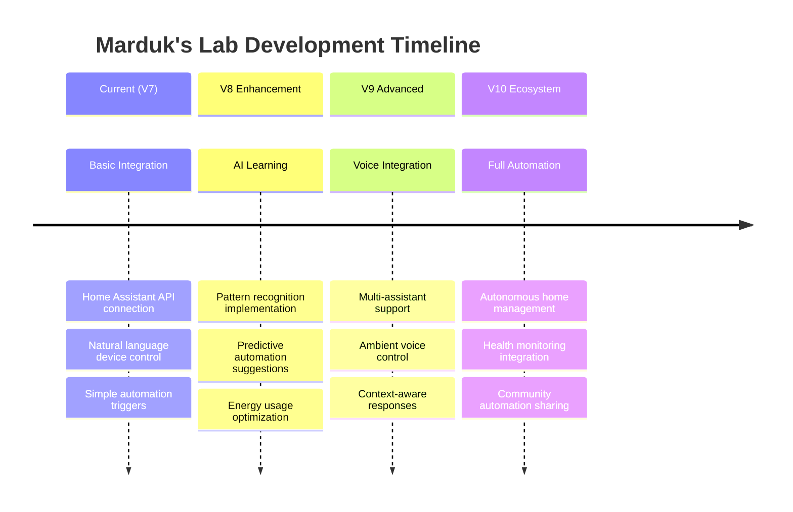

# Archon - Comprehensive Architecture Documentation

## Executive Summary

Archon represents a paradigm shift in autonomous AI agent development, implementing a recursive, hypergraph-centric architecture that transmutes implicit cognitive patterns into explicit, actionable knowledge. This documentation captures the emergent architecture through adaptive attention allocation mechanisms and cognitive synergy optimizations.

## High-Level System Overview

The Archon system operates as a multi-agent cognitive ecosystem with recursive self-improvement capabilities, integrated with OpenCog components for enhanced reasoning and knowledge representation.


This diagram illustrates the emergent cognitive patterns and neural-symbolic integration points within the Archon ecosystem, where hypergraph pattern encoding enables recursive implementation pathways.

## Module Interaction Architecture

The bidirectional synergies between core modules demonstrate adaptive attention allocation mechanisms:


## Data Flow and Signal Propagation Pathways

### Agent Creation Workflow Sequence


### OpenCog Knowledge Representation Flow


## Recursive Implementation Pathways

### Hypergraph Pattern Encoding

The Archon system implements recursive cognitive patterns through hypergraph structures that encode relationships between:

1. **User Requirements** → **Conceptual Nodes** in AtomSpace
2. **Documentation Knowledge** → **Semantic Relationships** via embeddings  
3. **Tool Libraries** → **Capability Mappings** through relevance scoring
4. **Agent Artifacts** → **Evolutionary Lineage** in conversation history

### Adaptive Attention Allocation Mechanisms


#### Mechanisms:

1. **Dynamic Priority Adjustment**: Resource allocation adapts based on agent complexity and user feedback patterns
2. **Parallel Processing Optimization**: Multiple agents execute concurrently with shared OpenCog state
3. **Emergent Pattern Recognition**: AtomSpace accumulates knowledge across sessions, improving future recommendations

### Cognitive Synergy Optimizations

The system demonstrates emergent intelligence through:

- **Cross-Agent Knowledge Sharing**: AtomSpace provides shared cognitive substrate
- **Recursive Refinement Loops**: Specialized agents iteratively improve each other's outputs  
- **Hypergraph Relationship Discovery**: New patterns emerge from node relationship analysis
- **Adaptive Tool Selection**: Relevance scoring evolves based on successful agent generations

## Core Architecture Components

### LangGraph Workflow Engine

**File**: `archon/archon_graph.py`

The LangGraph StateGraph orchestrates the multi-agent workflow with persistent state management and conditional routing:

```python
class AgentState(TypedDict):
    latest_user_message: str
    messages: Annotated[List[bytes], lambda x, y: x + y]
    scope: str
    advisor_output: str
    file_list: List[str]
    refined_prompt: str
    refined_tools: str
    refined_agent: str
    atomspace: Any
    cogserver: Any
    utilities: Any
```

### OpenCog Integration Layer

**Files**: `utils/opencog/`

Custom implementations provide cognitive enhancement:

- **AtomSpace** (`atomspace.py`): Knowledge representation with nodes, links, and truth values
- **CogServer** (`cogserver.py`): Cognitive process management and event handling
- **Utilities** (`utilities.py`): Advanced reasoning, pattern matching, and query optimization

### Agent Specialization Network

**Primary Agents**:
- **Reasoner Agent**: Scope definition with OpenCog-enhanced analysis
- **Advisor Agent**: Tool/example recommendation using AtomSpace categorization
- **Coder Agent**: RAG-powered code generation with vector database integration

**Refiner Agents**:
- **Prompt Refiner**: System prompt optimization
- **Tools Refiner**: Tool selection and MCP integration refinement  
- **Agent Refiner**: Configuration and dependency optimization

## Emergent Documentation Improvements

### Feedback Loop Establishment

The architecture includes multiple feedback mechanisms for continuous improvement:

1. **User Feedback Integration**: Direct incorporation of user corrections and preferences
2. **Cross-Session Learning**: AtomSpace persistence enables knowledge accumulation
3. **Performance Metrics**: Success patterns influence future resource allocation
4. **Emergent Pattern Detection**: Hypergraph analysis reveals new optimization opportunities

### Expandable Diagram Framework

As new patterns emerge, the documentation framework supports:

- **Dynamic Diagram Generation**: Mermaid diagrams can be programmatically updated
- **Pattern Library Expansion**: New architectural patterns documented as they develop
- **Version-Controlled Evolution**: Documentation tracks with system iterations
- **Community Contribution Integration**: External insights incorporated through PR workflow

## Technical Implementation Details

### Docker Architecture

```mermaid
graph TD
    subgraph "🐳 Container Ecosystem"
        MC[Main Container - Archon]
        MCPS[MCP Server Container]
    end
    
    subgraph "Main Container Services"
        UI[Streamlit UI :8501]
        GS[Graph Service :8100]
        AG[Agent Graph]
    end
    
    subgraph "MCP Container Services"
        MS[MCP Server]
        IR[IDE Router]
    end
    
    subgraph "External Services"
        SB[(Supabase Vector DB)]
        LLMP[LLM Providers]
        IDES[AI IDEs]
        HA_EXT[🏠 Home Assistant]
    end
    
    MC --> UI
    MC --> GS
    GS --> AG
    
    MCPS --> MS
    MS --> IR
    
    UI <--> GS
    GS <--> SB
    AG <--> LLMP
    IR <--> IDES
    MS <--> GS
    GS <--> HA_EXT
    
    classDef container fill:#e3f2fd
    classDef service fill:#f1f8e9
    classDef external fill:#fce4ec
    classDef homeassistant fill:#4caf50
    
    class MC,MCPS container
    class UI,GS,AG,MS,IR service
    class SB,LLMP,IDES external
    class HA_EXT homeassistant
```



### Home Assistant Integration Architecture

For smart home automation through Marduk's Lab, Archon includes sophisticated Home Assistant integration:

```mermaid
graph TB
    subgraph "🤖 Archon AI Layer"
        ARCHON_CORE[Archon Core]
        HA_AGENT[HA Control Agent]
        NLP_ENGINE[NLP Engine]
        PATTERN_LEARN[Pattern Learning]
    end
    
    subgraph "🏠 Home Assistant Layer"
        HA_CORE[Home Assistant Core]
        HA_API[REST API]
        HA_WS[WebSocket API]
        HA_AUTO[Automation Engine]
        HA_SCENES[Scene Manager]
    end
    
    subgraph "📱 Device Layer"
        ZIGBEE[Zigbee Devices]
        WIFI[WiFi Devices]
        ZWAVE[Z-Wave Devices]
        BLUETOOTH[Bluetooth LE]
    end
    
    subgraph "🧠 Intelligence Layer"
        OPENCOG[OpenCog AtomSpace]
        ML_MODELS[ML Models]
        PREDICTION[Predictive Engine]
        CONTEXT[Context Awareness]
    end
    
    ARCHON_CORE --> HA_AGENT
    HA_AGENT <--> HA_API
    HA_AGENT <--> HA_WS
    NLP_ENGINE --> HA_AUTO
    PATTERN_LEARN --> HA_SCENES
    
    HA_API --> HA_CORE
    HA_WS --> HA_CORE
    HA_CORE --> ZIGBEE
    HA_CORE --> WIFI
    HA_CORE --> ZWAVE
    HA_CORE --> BLUETOOTH
    
    HA_AGENT --> OPENCOG
    OPENCOG --> ML_MODELS
    ML_MODELS --> PREDICTION
    PREDICTION --> CONTEXT
    CONTEXT --> HA_AGENT
    
    classDef archon fill:#2196f3
    classDef ha fill:#4caf50
    classDef devices fill:#ff9800
    classDef intelligence fill:#9c27b0
    
    class ARCHON_CORE,HA_AGENT,NLP_ENGINE,PATTERN_LEARN archon
    class HA_CORE,HA_API,HA_WS,HA_AUTO,HA_SCENES ha
    class ZIGBEE,WIFI,ZWAVE,BLUETOOTH devices
    class OPENCOG,ML_MODELS,PREDICTION,CONTEXT intelligence
```



### Vector Database Schema

```sql
CREATE TABLE site_pages (
    id UUID PRIMARY KEY DEFAULT uuid_generate_v4(),
    url TEXT,
    chunk_number INTEGER,
    title TEXT,
    summary TEXT,
    content TEXT,
    metadata JSONB,
    embedding VECTOR(1536) -- OpenAI ada-002 dimensions
);
```

### Environment Configuration

Key environment variables for cognitive optimization:

- `REASONER_MODEL`: Enhanced reasoning LLM (o3-mini, R1)
- `PRIMARY_MODEL`: Main coding and interaction LLM
- `LLM_PROVIDER`: Provider selection (OpenAI, Anthropic, Ollama)
- `BASE_URL`: Custom LLM endpoint configuration
- `SUPABASE_*`: Vector database connection parameters
- `HOME_ASSISTANT_URL`: Home Assistant instance URL for Marduk's Lab
- `HOME_ASSISTANT_TOKEN`: Long-lived access token for HA integration

## Future Architecture Evolution

### Planned Enhancements

- **V8**: Self-feedback loop with automated validation and error correction
- **V9**: Isolated agent execution environment with testing frameworks
- **V10**: Multi-framework support for framework-agnostic generation
- **V11**: Autonomous framework learning with self-updating adapters
- **V12**: Advanced RAG techniques with enhanced retrieval mechanisms
- **V13**: MCP marketplace integration with agent distribution
- **Marduk's Lab Expansion**: 
  - Advanced predictive home automation
  - Energy optimization algorithms
  - Health and wellness monitoring integration
  - Voice assistant ecosystem integration

### Marduk's Lab Evolution Roadmap



### Adaptive Architecture Principles

The Archon architecture embodies principles of:

1. **Recursive Self-Improvement**: Each iteration enhances the system's ability to build better agents
2. **Emergent Intelligence**: Complex behaviors arise from simple agent interactions
3. **Cognitive Substrate Sharing**: OpenCog provides shared knowledge representation
4. **Hypergraph Relationship Discovery**: New patterns emerge through graph analysis
5. **Distributed Cognition**: Knowledge and processing distributed across specialized agents
6. **Physical-Digital Convergence**: Marduk's Lab bridges AI agents with physical world automation

This architectural documentation serves as a living document that evolves with the system, capturing both explicit design patterns and emergent cognitive behaviors that arise from the recursive, hypergraph-centric implementation.