# 🏠 Marduk's Lab - Home Assistant Integration Guide

## Overview

Marduk's Lab represents the convergence of Archon's AI agent capabilities with Home Assistant's home automation platform, creating an intelligent ecosystem that learns, adapts, and anticipates your needs.

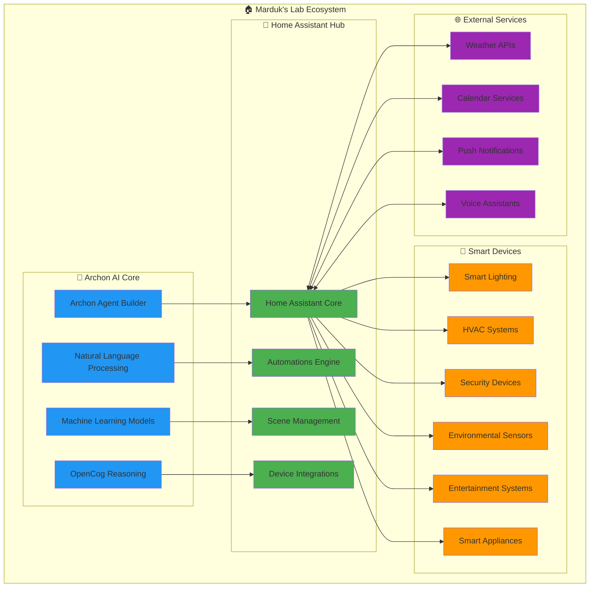

## 🎯 Architecture Overview

### Core Integration Layers

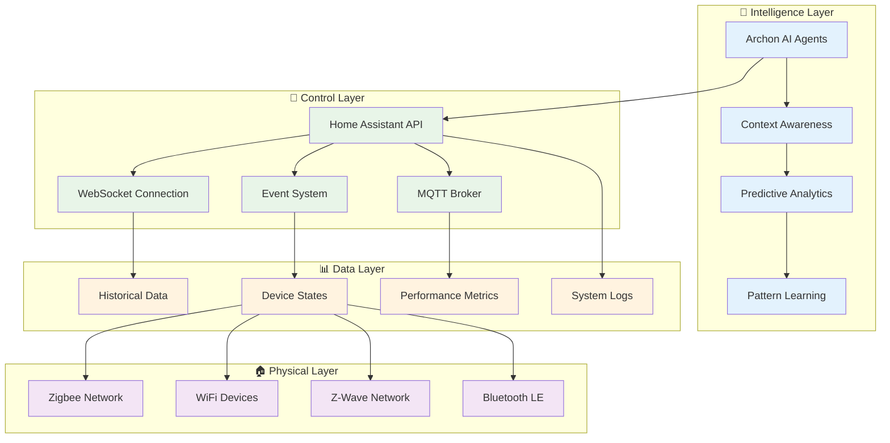

## 🚀 Quick Start Guide

### Step 1: Install Home Assistant

#### Option 1: Home Assistant OS (Recommended)
```bash
# Download and flash Home Assistant OS to SD card
# Insert into Raspberry Pi and boot
# Access via http://homeassistant.local:8123
```

#### Option 2: Docker Installation
```bash
# Create Home Assistant container
docker run -d \
  --name homeassistant \
  --privileged \
  --restart=unless-stopped \
  -e TZ=America/New_York \
  -v /path/to/config:/config \
  -v /run/dbus:/run/dbus:ro \
  --network=host \
  ghcr.io/home-assistant/home-assistant:stable
```

#### Option 3: Virtual Environment
```bash
# Install Home Assistant Core
python3 -m venv venv
source venv/bin/activate
pip install homeassistant
hass --open-ui
```

### Step 2: Configure Home Assistant for Archon

Add the following to your `configuration.yaml`:

```yaml
# Enable API access for Archon
api:
websocket_api:

# Enable advanced logging
logger:
  default: info
  logs:
    homeassistant.components.api: debug
    homeassistant.components.websocket_api: debug

# Enable HTTP integration for external access
http:
  api_password: !secret api_password
  cors_allowed_origins:
    - http://localhost:8501
    - http://localhost:8100

# Enable recorder for historical data
recorder:
  db_url: sqlite:///config/home-assistant_v2.db
  purge_keep_days: 365
  include:
    domains:
      - light
      - switch
      - sensor
      - climate
      - automation
      - script

# Enable template sensors for AI integration
template:
  - sensor:
      - name: "AI Context"
        state: "{{ states('sensor.ai_activity') }}"
        attributes:
          active_agents: "{{ states('sensor.active_agents') }}"
          learning_mode: "{{ states('input_boolean.learning_mode') }}"
```

### Step 3: Create Archon Home Assistant Agent

In Archon, create an agent with the following configuration:

```python
# Example agent prompt for Archon
agent_description = """
Create a Home Assistant integration agent that can:
1. Connect to Home Assistant via REST API and WebSocket
2. Monitor all device states and changes
3. Execute commands through natural language
4. Learn usage patterns and suggest automations
5. Provide intelligent scene recommendations
6. Handle voice commands and text inputs
7. Integrate with calendar and weather data
8. Create predictive automations based on patterns
"""
```

## 🔧 Advanced Configuration

### Home Assistant Agent Tools

The Archon-generated Home Assistant agent will include these core tools:

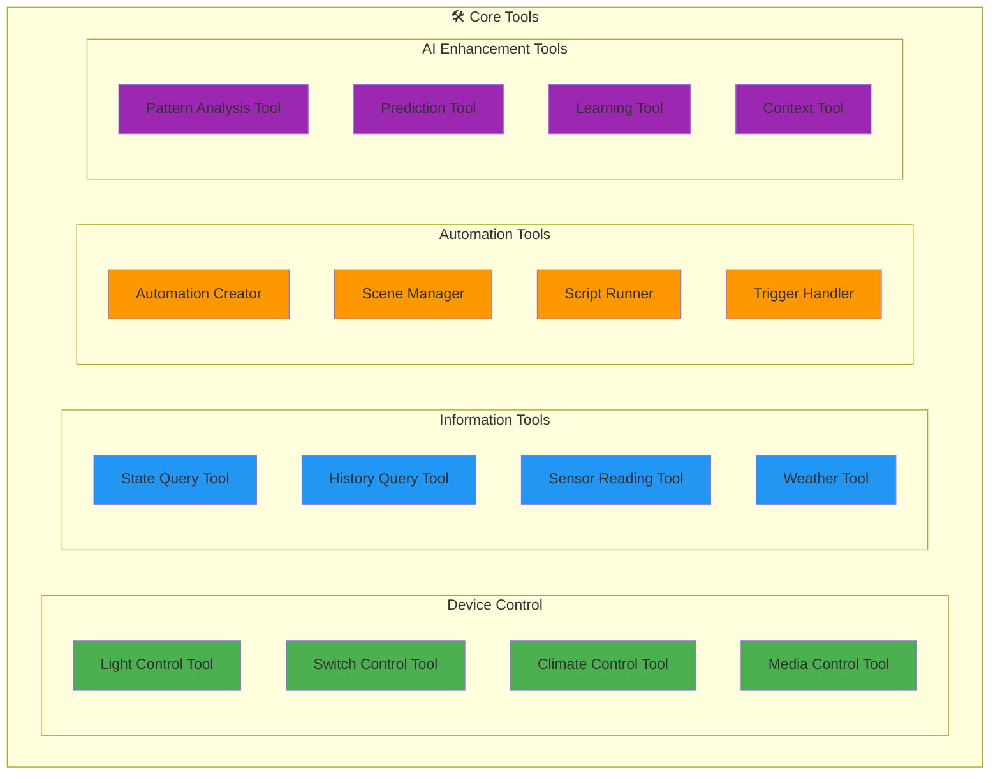

### Example Agent Implementation

Here's what the generated agent structure would look like:

```python
# agent.py - Core Home Assistant Agent
from pydantic_ai import Agent
from homeassistant_tools import HATools

ha_agent = Agent(
    'claude-3-5-sonnet-20241022',
    deps_type=HADeps,
    system_prompt="""
    You are Marduk, an intelligent home automation assistant powered by Archon.
    You can control all smart home devices, learn from usage patterns, and 
    proactively suggest improvements to make the home more comfortable and efficient.
    
    Core capabilities:
    - Natural language device control
    - Pattern recognition and learning
    - Predictive automation suggestions
    - Energy optimization recommendations
    - Security monitoring and alerts
    """
)

# agent_tools.py - Home Assistant Integration Tools
class HATools:
    def __init__(self, ha_url: str, token: str):
        self.ha_url = ha_url
        self.token = token
        self.session = aiohttp.ClientSession()
    
    async def call_service(self, domain: str, service: str, **kwargs):
        """Call Home Assistant service"""
        
    async def get_state(self, entity_id: str):
        """Get current state of entity"""
        
    async def get_history(self, entity_id: str, days: int = 1):
        """Get historical data"""
        
    async def create_automation(self, config: dict):
        """Create new automation"""
        
    async def analyze_patterns(self, entity_id: str):
        """Analyze usage patterns with OpenCog"""
```

## 🎯 Use Cases and Examples

### 1. Natural Language Control

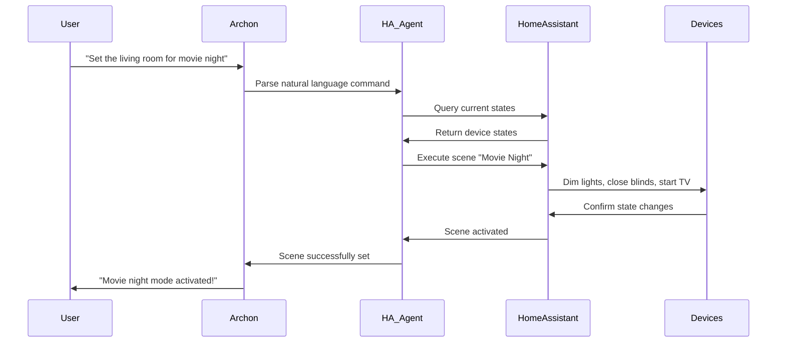

### 2. Predictive Automation

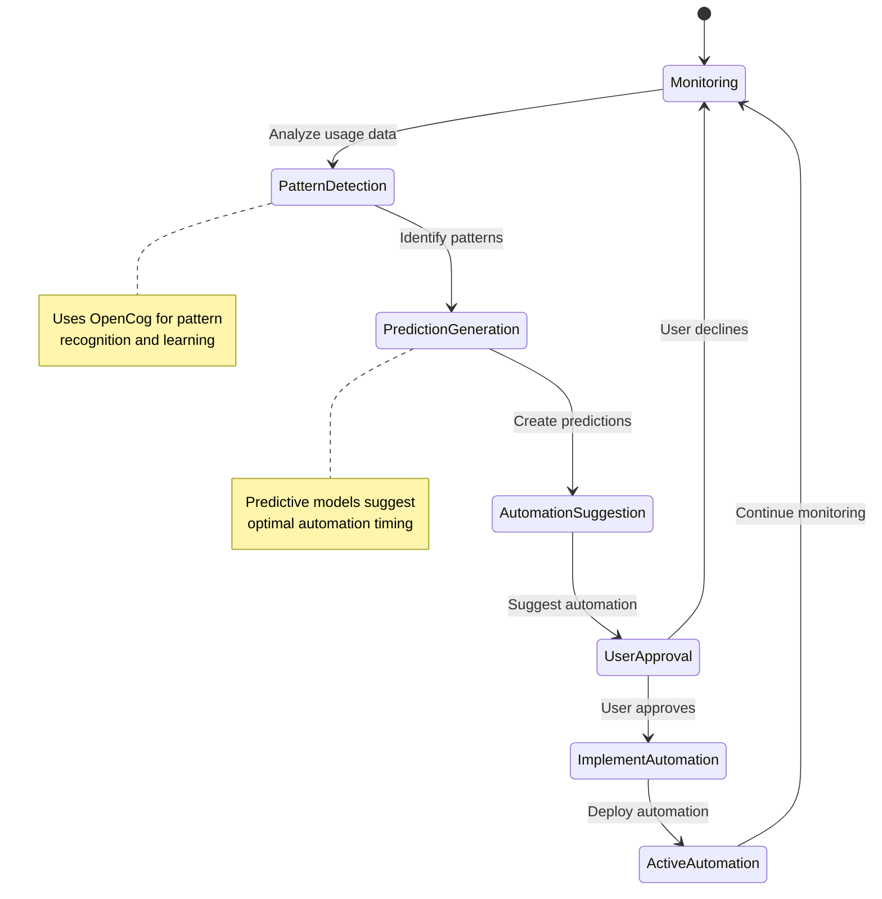

### 3. Energy Optimization

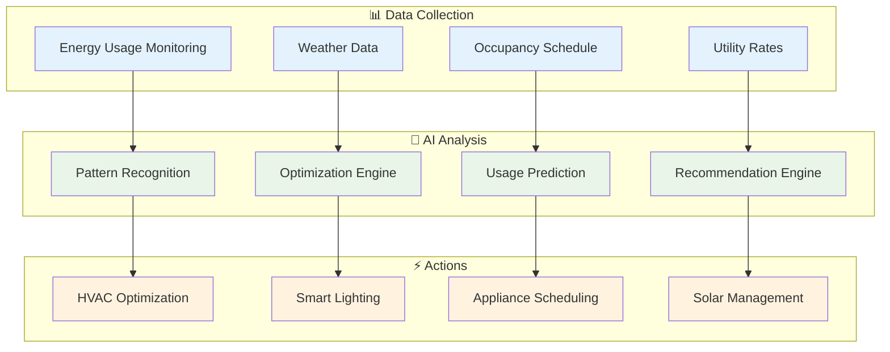

## 🔮 Advanced Features

### OpenCog Integration for Smart Learning

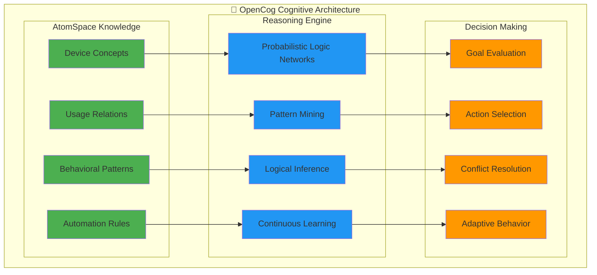

### Contextual Intelligence System

The system maintains context across multiple dimensions:

- **Temporal Context**: Time of day, day of week, seasonal patterns
- **Environmental Context**: Weather, lighting conditions, occupancy
- **Personal Context**: Preferences, habits, calendar events
- **Social Context**: Family member interactions, guest presence
- **Device Context**: Device states, capabilities, maintenance needs

### Security and Privacy

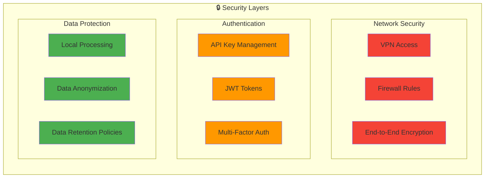

## 🚀 Deployment Scenarios

### 1. Local Deployment (Recommended)
- Home Assistant on local hardware
- Archon running in Docker containers
- All data processing on-premises
- Maximum privacy and control

### 2. Hybrid Cloud Deployment
- Home Assistant local for device control
- Archon AI processing in cloud
- Secure VPN connection
- Enhanced AI capabilities with cloud resources

### 3. Edge Computing Deployment
- All processing on local edge devices
- AI acceleration with dedicated hardware
- Real-time response capabilities
- Minimal internet dependency

## 📈 Performance Optimization

### Resource Management

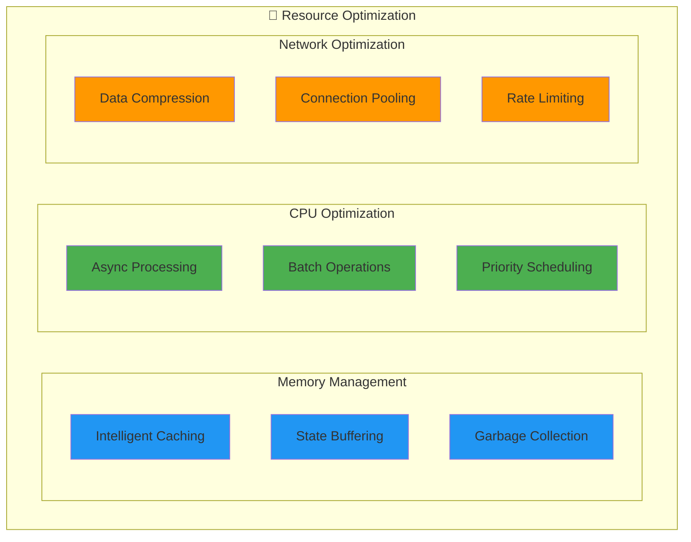

## 🔧 Troubleshooting

### Common Issues and Solutions

1. **Connection Issues**
   - Verify Home Assistant API token
   - Check network connectivity
   - Validate CORS settings

2. **Performance Issues**
   - Monitor resource usage
   - Optimize database queries
   - Implement caching strategies

3. **Integration Problems**
   - Check device compatibility
   - Verify integration configurations
   - Review automation conflicts

### Diagnostic Tools

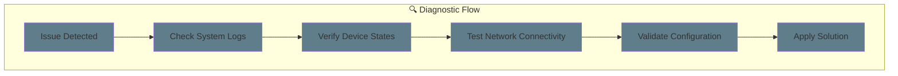

## 🌟 Future Enhancements

### Planned Features

- **Voice Integration**: Seamless voice control with multiple assistants
- **Mobile App**: Dedicated mobile application for remote control
- **AI Training**: Personalized AI training based on user behavior
- **Community Hub**: Sharing automations and configurations
- **Energy Trading**: Integration with energy markets and solar systems
- **Health Monitoring**: Integration with health and fitness devices

### Roadmap

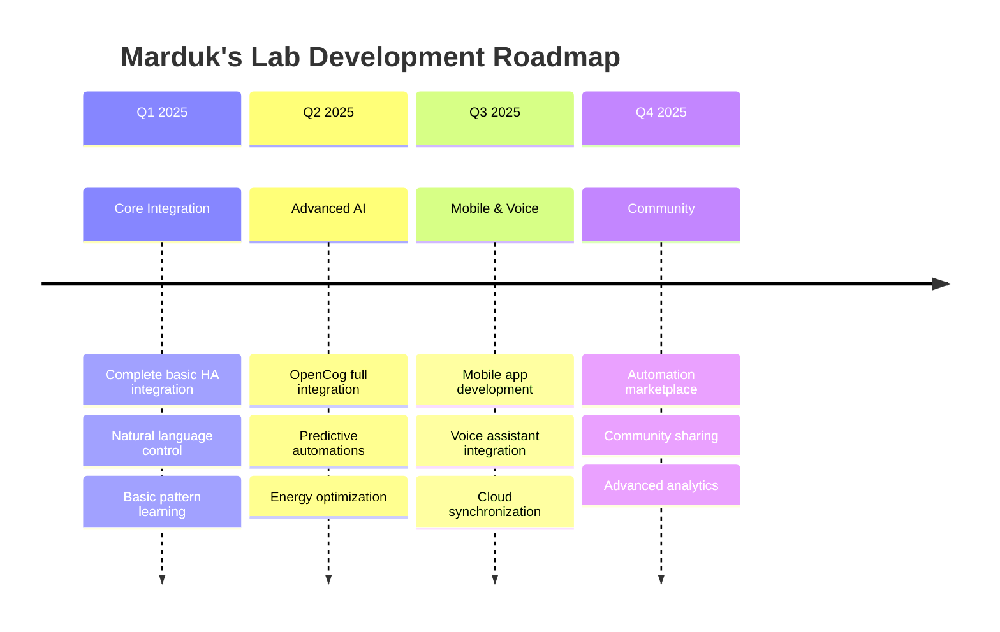

---

*Marduk's Lab represents the future of intelligent home automation, where AI agents understand, learn, and adapt to create the perfect living environment.*