# 🏠 Marduk's Lab - OpenCog Enhanced Home Assistant Integration Guide

## Overview

Marduk's Lab represents the convergence of Archon's AI agent capabilities with Home Assistant's home automation platform, enhanced by OpenCog's cognitive architecture to create an intelligent ecosystem that learns, adapts, and anticipates your needs through advanced reasoning and pattern recognition.

**🧠 NEW: OpenCog Cognitive Enhancement**
Marduk's Lab now features integrated OpenCog components that provide:
- **Cognitive Pattern Recognition**: Advanced analysis of device usage patterns
- **Predictive Automation**: AI-driven suggestions based on learned behaviors
- **Knowledge Persistence**: Device states and relationships stored in AtomSpace
- **Temporal Reasoning**: Time-aware automation optimization
- **Collaborative Intelligence**: Knowledge sharing with other Archon agents

```mermaid
graph TB
    subgraph "🏠 Marduk's Lab Cognitive Ecosystem"
        subgraph "🤖 Archon AI Core"
            ARCHON[Archon Agent Builder]
            NLP[Natural Language Processing]
            ML[Machine Learning Models]
            REASONING[OpenCog Reasoning]
            ATOMSPACE[AtomSpace Knowledge]
            COGSERVER[CogServer Process Management]
        end
        
        subgraph "🏡 Home Assistant Hub"
            HA[Home Assistant Core]
            AUTO[Automations Engine]
            SCENES[Scene Management]
            INTEGRATIONS[Device Integrations]
        end
        
        subgraph "📱 Smart Devices"
            LIGHTS[Smart Lighting]
            CLIMATE[HVAC Systems]
            SECURITY[Security Devices]
            SENSORS[Environmental Sensors]
            MEDIA[Entertainment Systems]
            APPLIANCES[Smart Appliances]
        end
        
        subgraph "🌐 External Services"
            WEATHER[Weather APIs]
            CALENDAR[Calendar Services]
            NOTIFICATIONS[Push Notifications]
            VOICE[Voice Assistants]
        end
        
        subgraph "🧠 Cognitive Layer"
            PATTERN[Pattern Recognition]
            PREDICT[Predictive Analysis]
            LEARN[Continuous Learning]
            OPTIMIZE[Energy Optimization]
        end
    end
    
    ARCHON --> HA
    NLP --> AUTO
    ML --> SCENES
    REASONING --> INTEGRATIONS
    ATOMSPACE --> PATTERN
    COGSERVER --> PREDICT
    
    HA --> LIGHTS
    HA --> CLIMATE
    HA --> SECURITY
    HA --> SENSORS
    HA --> MEDIA
    HA --> APPLIANCES
    
    HA <--> WEATHER
    HA <--> CALENDAR
    HA <--> NOTIFICATIONS
    HA <--> VOICE
    
    PATTERN --> LEARN
    PREDICT --> OPTIMIZE
    LEARN --> AUTO
    OPTIMIZE --> SCENES
    
    classDef ai fill:#2196f3
    classDef ha fill:#4caf50
    classDef devices fill:#ff9800
    classDef services fill:#9c27b0
    classDef cognitive fill:#e91e63
    
    class ARCHON,NLP,ML,REASONING,ATOMSPACE,COGSERVER ai
    class HA,AUTO,SCENES,INTEGRATIONS ha
    class LIGHTS,CLIMATE,SECURITY,SENSORS,MEDIA,APPLIANCES devices
    class WEATHER,CALENDAR,NOTIFICATIONS,VOICE services
    class PATTERN,PREDICT,LEARN,OPTIMIZE cognitive
```



## 🎯 Architecture Overview

### Core Integration Layers

```mermaid
flowchart TD
    subgraph "🧠 Intelligence Layer"
        AI[Archon AI Agents]
        CONTEXT[Context Awareness]
        PREDICTION[Predictive Analytics]
        LEARNING[Pattern Learning]
    end
    
    subgraph "🔧 Control Layer"
        HA_API[Home Assistant API]
        WEBSOCKET[WebSocket Connection]
        MQTT[MQTT Broker]
        EVENTS[Event System]
    end
    
    subgraph "📊 Data Layer"
        HISTORY[Historical Data]
        STATE[Device States]
        METRICS[Performance Metrics]
        LOGS[System Logs]
    end
    
    subgraph "🏠 Physical Layer"
        ZIGBEE[Zigbee Network]
        WIFI[WiFi Devices]
        ZWAVE[Z-Wave Network]
        BLUETOOTH[Bluetooth LE]
    end
    
    AI --> CONTEXT
    CONTEXT --> PREDICTION
    PREDICTION --> LEARNING
    
    AI --> HA_API
    HA_API --> WEBSOCKET
    HA_API --> MQTT
    HA_API --> EVENTS
    
    WEBSOCKET --> HISTORY
    EVENTS --> STATE
    MQTT --> METRICS
    HA_API --> LOGS
    
    STATE --> ZIGBEE
    STATE --> WIFI
    STATE --> ZWAVE
    STATE --> BLUETOOTH
    
    classDef intelligence fill:#e3f2fd
    classDef control fill:#e8f5e8
    classDef data fill:#fff3e0
    classDef physical fill:#f3e5f5
    
    class AI,CONTEXT,PREDICTION,LEARNING intelligence
    class HA_API,WEBSOCKET,MQTT,EVENTS control
    class HISTORY,STATE,METRICS,LOGS data
    class ZIGBEE,WIFI,ZWAVE,BLUETOOTH physical
```



## 🚀 Quick Start Guide

### Step 1: Install Home Assistant

#### Option 1: Home Assistant OS (Recommended)
```bash
# Download and flash Home Assistant OS to SD card
# Insert into Raspberry Pi and boot
# Access via http://homeassistant.local:8123
```

#### Option 2: Docker Installation
```bash
# Create Home Assistant container
docker run -d \
  --name homeassistant \
  --privileged \
  --restart=unless-stopped \
  -e TZ=America/New_York \
  -v /path/to/config:/config \
  -v /run/dbus:/run/dbus:ro \
  --network=host \
  ghcr.io/home-assistant/home-assistant:stable
```

#### Option 3: Virtual Environment
```bash
# Install Home Assistant Core
python3 -m venv venv
source venv/bin/activate
pip install homeassistant
hass --open-ui
```

### Step 2: Configure Home Assistant for Archon

Add the following to your `configuration.yaml`:

```yaml
# Enable API access for Archon
api:
websocket_api:

# Enable advanced logging
logger:
  default: info
  logs:
    homeassistant.components.api: debug
    homeassistant.components.websocket_api: debug

# Enable HTTP integration for external access
http:
  api_password: !secret api_password
  cors_allowed_origins:
    - http://localhost:8501
    - http://localhost:8100

# Enable recorder for historical data
recorder:
  db_url: sqlite:///config/home-assistant_v2.db
  purge_keep_days: 365
  include:
    domains:
      - light
      - switch
      - sensor
      - climate
      - automation
      - script

# Enable template sensors for AI integration
template:
  - sensor:
      - name: "AI Context"
        state: "{{ states('sensor.ai_activity') }}"
        attributes:
          active_agents: "{{ states('sensor.active_agents') }}"
          learning_mode: "{{ states('input_boolean.learning_mode') }}"
```

### Step 3: Create OpenCog-Enhanced Archon Home Assistant Agent

In Archon, create an agent with the following enhanced configuration that leverages OpenCog's cognitive capabilities:

```python
# Enhanced agent prompt for Archon with OpenCog integration
agent_description = """
Create a cognitive Home Assistant integration agent that can:
1. Connect to Home Assistant via REST API and WebSocket with cognitive awareness
2. Monitor all device states and store knowledge in OpenCog AtomSpace
3. Execute commands through natural language with contextual understanding
4. Learn usage patterns using OpenCog's pattern recognition engine
5. Provide intelligent scene recommendations based on cognitive analysis
6. Handle voice commands and text inputs with semantic understanding
7. Integrate with calendar and weather data for contextual automation
8. Create predictive automations using OpenCog's reasoning capabilities
9. Store and share knowledge with other Archon agents through AtomSpace
10. Continuously learn and adapt based on user interactions and preferences

Enhanced features with OpenCog:
- Cognitive pattern recognition for device usage optimization
- Predictive automation suggestions based on learned behaviors
- Knowledge persistence across sessions for continuous improvement
- Temporal reasoning for time-aware automation scheduling
- Energy efficiency optimization through semantic understanding
- Cross-device relationship analysis for coordinated automation
"""
```

## 🔧 Advanced Configuration

### Enhanced Home Assistant Agent Tools with OpenCog

The Archon-generated Home Assistant agent will include these enhanced cognitive tools:


### Enhanced Example Agent Implementation

Here's what the generated agent structure looks like with OpenCog integration:

```python
# agent.py - Enhanced Cognitive Home Assistant Agent
from pydantic_ai import Agent
from homeassistant_tools import CognitiveHomeAssistantAPI
from utils.opencog import opencog

# Enhanced dependencies with OpenCog components
class HADeps(BaseModel):
    model_config = {"arbitrary_types_allowed": True}
    
    ha_url: str
    ha_token: str
    ha_api: Optional[CognitiveHomeAssistantAPI] = None
    # OpenCog cognitive components
    atomspace: Optional[object] = None
    cogserver: Optional[object] = None
    utilities: Optional[object] = None

marduk_agent = Agent(
    'claude-3-5-sonnet-20241022',
    deps_type=HADeps,
    system_prompt="""
    You are Marduk, an intelligent home automation assistant powered by Archon's OpenCog cognitive architecture.
    You can control all smart home devices through Home Assistant, learn from usage patterns using advanced
    cognitive reasoning, and proactively suggest improvements to make the home more comfortable and efficient.
    
    Enhanced capabilities with OpenCog integration:
    - Natural language device control with contextual understanding
    - Real-time device status monitoring stored in cognitive AtomSpace
    - Advanced pattern recognition using OpenCog's reasoning engine
    - Predictive automation suggestions based on cognitive learning
    - Energy optimization recommendations with semantic understanding
    - Knowledge persistence across sessions using AtomSpace
    - Collaborative reasoning with other Archon agents
    """
)

# Enhanced cognitive tools
async def initialize_cognitive_components(deps: HADeps):
    """Initialize OpenCog components for cognitive reasoning."""
    if not deps.atomspace:
        deps.atomspace = opencog.atomspace()
        deps.cogserver = opencog.cogserver(deps.atomspace)
        deps.utilities = opencog.utilities(deps.atomspace)
        
        # Create foundational knowledge structure
        home_concept = deps.atomspace.add_node("ConceptNode", "HomeAutomation")
        device_concept = deps.atomspace.add_node("ConceptNode", "SmartDevice")
        # ... establish relationships using AtomSpace

@marduk_agent.tool
async def call_ha_service_with_cognition(ctx, domain, service, entity_id=None, **service_data):
    """Enhanced service calls with cognitive learning and insights."""
    # Store interaction in AtomSpace for learning
    # Generate cognitive insights
    # Apply OpenCog reasoning for optimization suggestions
    pass

@marduk_agent.tool
async def analyze_usage_patterns_with_cognition(ctx, entity_id, hours=24):
    """Advanced pattern analysis using OpenCog's cognitive reasoning."""
    # Comprehensive cognitive analysis with predictions and recommendations
    pass
```

## 🧪 Testing the OpenCog Integration

### Quick Integration Test

To verify that OpenCog is properly integrated with Marduk's Lab, run the provided test script:

```bash
cd /path/to/Archon
python test_simple_integration.py
```

This test will verify:
- ✅ OpenCog components import successfully
- ✅ AtomSpace initialization with home automation knowledge
- ✅ Cognitive reasoning for device optimization
- ✅ Pattern recognition and temporal reasoning capabilities
- ✅ Knowledge persistence and querying functionality

### Expected Test Output

A successful integration test will show:
```
🏠🧠 Testing Marduk's Lab OpenCog Integration
============================================================
✅ OpenCog components imported successfully
🧠 AtomSpace initialized: 0 atoms
⚡ CogServer ready for cognitive processing
🔍 Utilities configured for advanced reasoning

🏠 Creating Home Automation Knowledge Base:
--------------------------------------------------
✅ Created core concepts: 5 atoms
✅ Added Light device category
✅ Added Climate device category
... (additional device setup)

🧠 Testing Cognitive Reasoning:
----------------------------------------
🎯 Cognitive Insights for Marduk's Lab:
  📊 Managing 12 smart devices
  💡 2 lighting devices - consider motion automation
  🌡️ 1 climate devices - enable occupancy scheduling
  🔒 4 security devices - configure smart alerts
  🤖 Create smart scenes for common scenarios
  ⚡ Implement energy monitoring for optimization

🎉 Integration Test Complete!
🌟 Marduk's Lab enhanced with 54+ knowledge atoms
🧠 OpenCog cognitive reasoning ready for home automation

✅ All tests passed! OpenCog integration successful.
```

### Enhanced Agent Testing

To test the full enhanced agent functionality:

1. **Configure Home Assistant**: Ensure your HA instance is accessible
2. **Set API Token**: Configure your long-lived access token
3. **Run Enhanced Agent**: Use the OpenCog-enhanced Marduk agent

```python
# Example test with real Home Assistant instance
deps = HADeps(
    ha_url="http://your-homeassistant:8123",
    ha_token="your_long_lived_access_token"
)

# Test cognitive device control
result = await call_ha_service_with_cognition(
    ctx, 'light', 'turn_on', 
    entity_id='light.living_room', 
    brightness=255
)

# Test cognitive pattern analysis
analysis = await analyze_usage_patterns_with_cognition(
    ctx, 'light.living_room', hours=48
)
```

## 🎯 Use Cases and Examples

### 1. Natural Language Control


### 2. Predictive Automation


### 3. Energy Optimization


## 🔮 Advanced Features

### OpenCog Integration for Smart Learning

```mermaid
graph TB
    subgraph "🧠 OpenCog Cognitive Architecture"
        subgraph "AtomSpace Knowledge"
            CONCEPTS[Device Concepts]
            RELATIONS[Usage Relations]
            PATTERNS[Behavioral Patterns]
            RULES[Automation Rules]
        end
        
        subgraph "Reasoning Engine"
            PLN[Probabilistic Logic Networks]
            PATTERN_MINING[Pattern Mining]
            INFERENCE[Logical Inference]
            LEARNING[Continuous Learning]
        end
        
        subgraph "Decision Making"
            GOAL_EVAL[Goal Evaluation]
            ACTION_SEL[Action Selection]
            CONFLICT_RES[Conflict Resolution]
            ADAPTATION[Adaptive Behavior]
        end
    end
    
    CONCEPTS --> PLN
    RELATIONS --> PATTERN_MINING
    PATTERNS --> INFERENCE
    RULES --> LEARNING
    
    PLN --> GOAL_EVAL
    PATTERN_MINING --> ACTION_SEL
    INFERENCE --> CONFLICT_RES
    LEARNING --> ADAPTATION
    
    classDef knowledge fill:#4caf50
    classDef reasoning fill:#2196f3
    classDef decision fill:#ff9800
    
    class CONCEPTS,RELATIONS,PATTERNS,RULES knowledge
    class PLN,PATTERN_MINING,INFERENCE,LEARNING reasoning
    class GOAL_EVAL,ACTION_SEL,CONFLICT_RES,ADAPTATION decision
```



### Contextual Intelligence System

The system maintains context across multiple dimensions:

- **Temporal Context**: Time of day, day of week, seasonal patterns
- **Environmental Context**: Weather, lighting conditions, occupancy
- **Personal Context**: Preferences, habits, calendar events
- **Social Context**: Family member interactions, guest presence
- **Device Context**: Device states, capabilities, maintenance needs

### Security and Privacy

```mermaid
flowchart LR
    subgraph "🔒 Security Layers"
        subgraph "Network Security"
            VPN[VPN Access]
            FIREWALL[Firewall Rules]
            ENCRYPTION[End-to-End Encryption]
        end
        
        subgraph "Authentication"
            API_KEYS[API Key Management]
            TOKENS[JWT Tokens]
            MFA[Multi-Factor Auth]
        end
        
        subgraph "Data Protection"
            LOCAL[Local Processing]
            ANONYMIZATION[Data Anonymization]
            RETENTION[Data Retention Policies]
        end
    end
    
    classDef security fill:#f44336
    classDef auth fill:#ff9800
    classDef privacy fill:#4caf50
    
    class VPN,FIREWALL,ENCRYPTION security
    class API_KEYS,TOKENS,MFA auth
    class LOCAL,ANONYMIZATION,RETENTION privacy
```



## 🚀 Deployment Scenarios

### 1. Local Deployment (Recommended)
- Home Assistant on local hardware
- Archon running in Docker containers
- All data processing on-premises
- Maximum privacy and control

### 2. Hybrid Cloud Deployment
- Home Assistant local for device control
- Archon AI processing in cloud
- Secure VPN connection
- Enhanced AI capabilities with cloud resources

### 3. Edge Computing Deployment
- All processing on local edge devices
- AI acceleration with dedicated hardware
- Real-time response capabilities
- Minimal internet dependency

## 📈 Performance Optimization

### Resource Management

```mermaid
graph TB
    subgraph "💾 Resource Optimization"
        subgraph "Memory Management"
            CACHE[Intelligent Caching]
            BUFFER[State Buffering]
            GC[Garbage Collection]
        end
        
        subgraph "CPU Optimization"
            ASYNC[Async Processing]
            BATCH[Batch Operations]
            PRIORITY[Priority Scheduling]
        end
        
        subgraph "Network Optimization"
            COMPRESSION[Data Compression]
            POOLING[Connection Pooling]
            THROTTLING[Rate Limiting]
        end
    end
    
    classDef memory fill:#2196f3
    classDef cpu fill:#4caf50
    classDef network fill:#ff9800
    
    class CACHE,BUFFER,GC memory
    class ASYNC,BATCH,PRIORITY cpu
    class COMPRESSION,POOLING,THROTTLING network
```



## 🔧 Troubleshooting

### Common Issues and Solutions

1. **Connection Issues**
   - Verify Home Assistant API token
   - Check network connectivity
   - Validate CORS settings

2. **Performance Issues**
   - Monitor resource usage
   - Optimize database queries
   - Implement caching strategies

3. **Integration Problems**
   - Check device compatibility
   - Verify integration configurations
   - Review automation conflicts

### Diagnostic Tools

```mermaid
flowchart TD
    subgraph "🔍 Diagnostic Flow"
        START[Issue Detected]
        LOG_CHECK[Check System Logs]
        STATE_VERIFY[Verify Device States]
        NETWORK_TEST[Test Network Connectivity]
        CONFIG_VALIDATE[Validate Configuration]
        SOLUTION[Apply Solution]
    end
    
    START --> LOG_CHECK
    LOG_CHECK --> STATE_VERIFY
    STATE_VERIFY --> NETWORK_TEST
    NETWORK_TEST --> CONFIG_VALIDATE
    CONFIG_VALIDATE --> SOLUTION
    
    classDef diagnostic fill:#607d8b
    class START,LOG_CHECK,STATE_VERIFY,NETWORK_TEST,CONFIG_VALIDATE,SOLUTION diagnostic
```



## 🌟 Future Enhancements

### Planned Features

- **Voice Integration**: Seamless voice control with multiple assistants
- **Mobile App**: Dedicated mobile application for remote control
- **AI Training**: Personalized AI training based on user behavior
- **Community Hub**: Sharing automations and configurations
- **Energy Trading**: Integration with energy markets and solar systems
- **Health Monitoring**: Integration with health and fitness devices

### Roadmap


---

*Marduk's Lab represents the future of intelligent home automation, where AI agents understand, learn, and adapt to create the perfect living environment.*