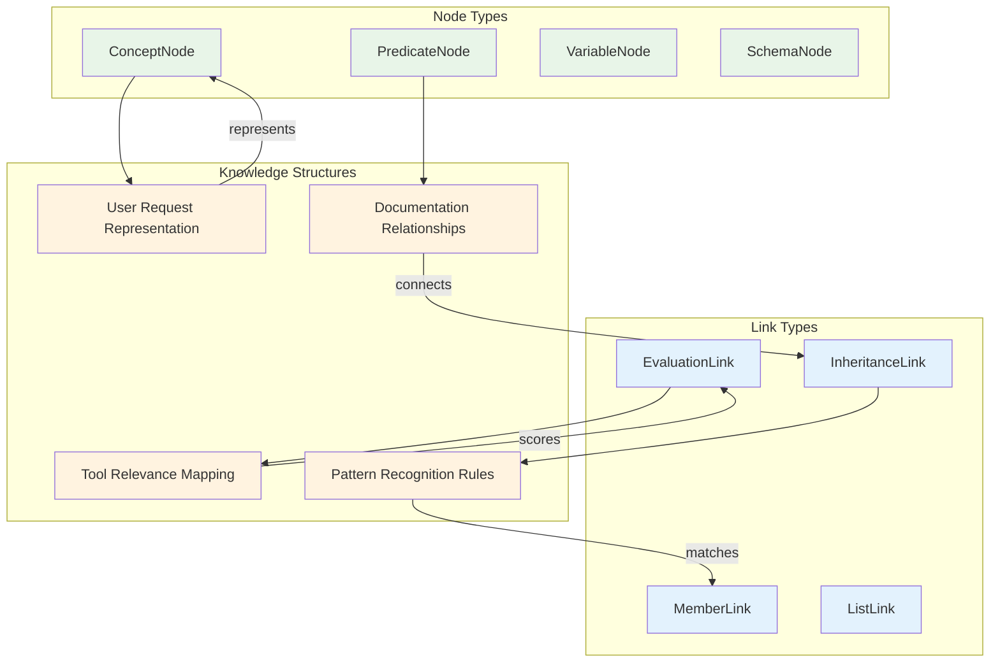
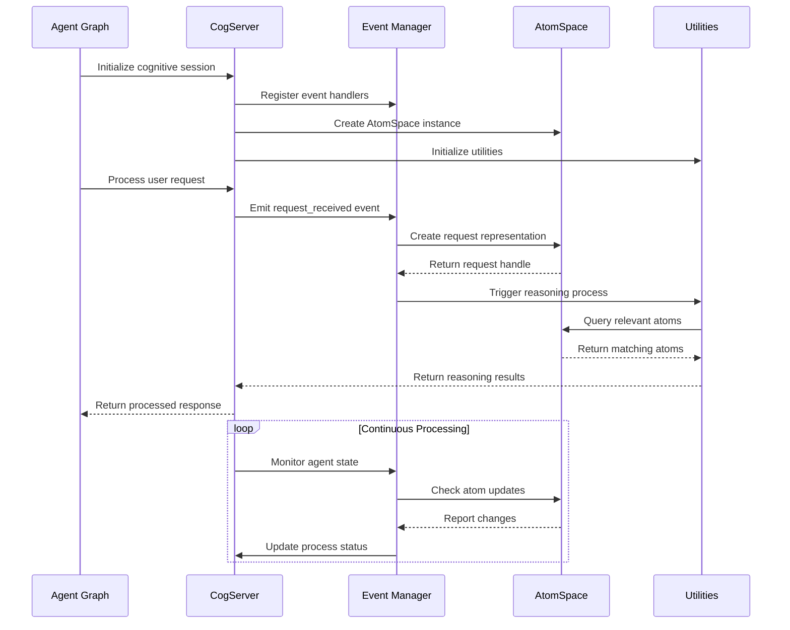
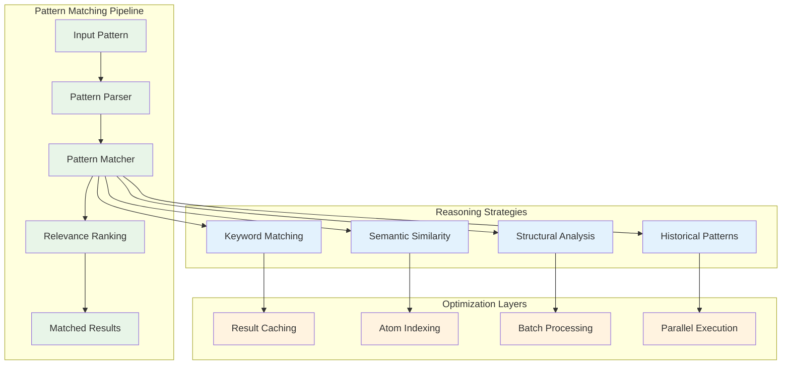
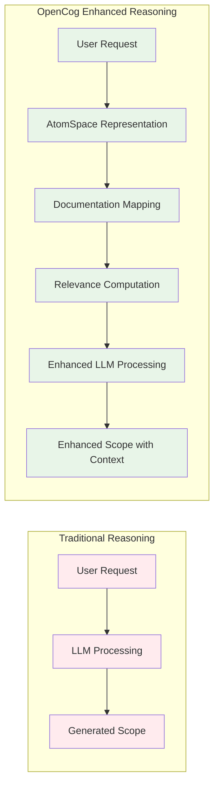
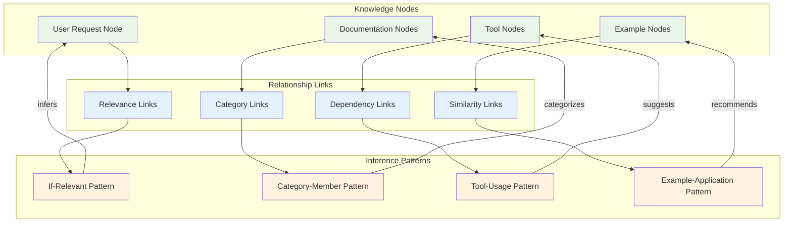
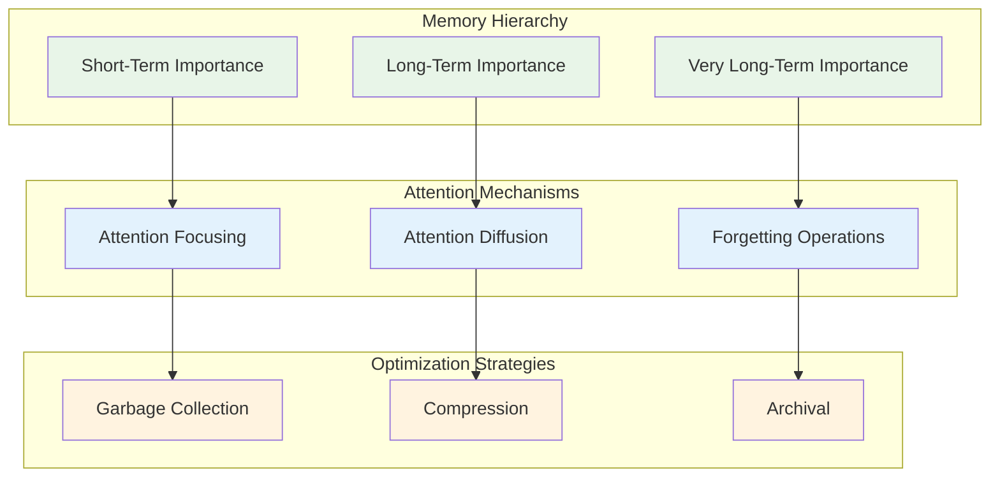

# OpenCog Integration Architecture

## Cognitive Substrate Implementation

The Archon system integrates OpenCog components to provide advanced reasoning capabilities through a custom implementation that maintains compatibility with the existing codebase while leveraging cognitive computing principles.

## OpenCog Components Overview

```mermaid
graph TB
    subgraph "OpenCog Cognitive Layer"
        AS[AtomSpace - Knowledge Representation]
        CS[CogServer - Process Management]
        UT[Utilities - Advanced Reasoning]
    end
    
    subgraph "AtomSpace Architecture"
        CN[ConceptNodes]
        LN[LinkNodes]
        TV[TruthValues]
        AT[Attention Values]
    end
    
    subgraph "CogServer Processes"
        EM[Event Manager]
        MS[Message System]
        PM[Process Monitor]
        RP[Request Processor]
    end
    
    subgraph "Utilities Components"
        QE[Query Engine]
        PM_UTIL[Pattern Matcher]
        AR[Atomese Reasoners]
        KG[Knowledge Graph Builder]
    end
    
    subgraph "Archon Integration Points"
        RA[Reasoner Agent]
        AA[Advisor Agent]
        SCOPE[Scope Definition]
        FILE_REL[File Relevance]
    end
    
    AS --> CN
    AS --> LN
    AS --> TV
    AS --> AT
    
    CS --> EM
    CS --> MS
    CS --> PM
    CS --> RP
    
    UT --> QE
    UT --> PM_UTIL
    UT --> AR
    UT --> KG
    
    AS --> RA
    AS --> AA
    CS --> SCOPE
    UT --> FILE_REL
    
    classDef opencogCore fill:#e8f5e8
    classDef atomspace fill:#e3f2fd
    classDef cogserver fill:#fff3e0
    classDef utilities fill:#fce4ec
    classDef integration fill:#f3e5f5
    
    class AS,CS,UT opencogCore
    class CN,LN,TV,AT atomspace
    class EM,MS,PM,RP cogserver
    class QE,PM_UTIL,AR,KG utilities
    class RA,AA,SCOPE,FILE_REL integration
```



## AtomSpace Knowledge Representation

### Node and Link Structure

The AtomSpace implementation provides a hypergraph-based knowledge representation system:



### Implementation in Archon

**File**: `utils/opencog/atomspace.py`

```python
class AtomSpace:
    def __init__(self):
        self.atoms = {}
        self.node_counter = 0
        self.link_counter = 0
    
    def add_node(self, node_type: str, name: str, truth_value=None):
        """Add a node to the AtomSpace with optional truth value"""
        handle = f"{node_type}_{self.node_counter}"
        self.node_counter += 1
        
        atom = {
            "type": node_type,
            "name": name,
            "handle": handle,
            "truth_value": truth_value or {"strength": 1.0, "confidence": 1.0},
            "attention_value": {"sti": 0, "lti": 0, "vlti": 0}
        }
        
        self.atoms[handle] = atom
        return handle
```

## CogServer Process Management

### Event-Driven Architecture



### Process Lifecycle Management

**File**: `utils/opencog/cogserver.py`

The CogServer manages cognitive processes throughout the agent lifecycle:

1. **Initialization Phase**: Set up AtomSpace and register reasoners
2. **Request Processing**: Handle incoming agent requests
3. **Knowledge Integration**: Merge new information with existing knowledge
4. **Reasoning Coordination**: Orchestrate multiple reasoning processes
5. **Result Synthesis**: Combine reasoning outputs for agent consumption

## Utilities and Advanced Reasoning

### Pattern Matching Engine



### Reasoner Registration and Application

**File**: `utils/opencog/utilities.py`

```python
def register_reasoner(self, name: str, reasoning_function: Callable):
    """Register a reasoning function with the utilities"""
    self.reasoners[name] = reasoning_function

def apply_reasoner(self, reasoner_name: str, *args, **kwargs):
    """Apply a registered reasoner with given arguments"""
    if reasoner_name in self.reasoners:
        return self.reasoners[reasoner_name](self.atomspace, *args, **kwargs)
    return None
```

## Integration with Archon Agents

### Reasoner Agent Enhancement



### Advisor Agent File Relevance

The Advisor Agent leverages OpenCog for intelligent file categorization and relevance scoring:

```python
# Register a simple reasoner to identify relevant documentation
def doc_relevance_reasoner(atomspace, request_text):
    """Simple reasoner to identify relevant documentation pages"""
    relevant_docs = []
    request_words = set(request_text.lower().split())
    
    # Get all documentation pages from AtomSpace
    doc_list = atomspace.get_atom(doc_list_node)
    
    # Find relevant docs based on simple word overlap
    for doc_handle in utilities.query_atoms(type_filter="ConceptNode"):
        doc = atomspace.get_atom(doc_handle)
        if doc and "name" in doc:
            doc_name = doc["name"]
            if any(word in doc_name.lower() for word in request_words):
                relevant_docs.append(doc_name)
                
    return relevant_docs
```

## Knowledge Graph Construction

### Hypergraph Relationships



### Triples and Knowledge Extraction

```python
def create_knowledge_graph(self, triples: List[tuple]):
    """Create a knowledge graph from RDF-like triples"""
    for subject, predicate, object_node in triples:
        # Create or get subject node
        subj_handle = self.atomspace.add_node("ConceptNode", subject)
        
        # Create or get predicate node
        pred_handle = self.atomspace.add_node("PredicateNode", predicate)
        
        # Create or get object node
        obj_handle = self.atomspace.add_node("ConceptNode", object_node)
        
        # Create evaluation link
        list_handle = self.atomspace.add_link("ListLink", [subj_handle, obj_handle])
        eval_handle = self.atomspace.add_link("EvaluationLink", [pred_handle, list_handle])
        
        return eval_handle
```

## Cognitive Synergy Optimizations

### Cross-Agent Knowledge Sharing

```mermaid
stateDiagram-v2
    [*] --> KnowledgeCreation: Agent generates knowledge
    
    state KnowledgeCreation {
        [*] --> NodeGeneration: Create concept nodes
        NodeGeneration --> LinkFormation: Establish relationships
        LinkFormation --> TruthAssignment: Assign truth values
        TruthAssignment --> [*]
    }
    
    KnowledgeCreation --> KnowledgeSharing: Share with AtomSpace
    
    state KnowledgeSharing {
        [*] --> AtomSpaceUpdate: Update shared knowledge
        AtomSpaceUpdate --> IndexRebuild: Rebuild search indices
        IndexRebuild --> ConsistencyCheck: Verify consistency
        ConsistencyCheck --> [*]
    }
    
    KnowledgeSharing --> KnowledgeRetrieval: Other agents access
    
    state KnowledgeRetrieval {
        [*] --> QueryFormulation: Formulate queries
        QueryFormulation --> PatternMatching: Match patterns
        PatternMatching --> RelevanceScoring: Score relevance
        RelevanceScoring --> ResultRanking: Rank results
        ResultRanking --> [*]
    }
    
    KnowledgeRetrieval --> KnowledgeApplication: Apply to agent tasks
    KnowledgeApplication --> [*]: Complete cycle
```



### Emergent Pattern Recognition

The OpenCog integration enables emergent intelligence through:

1. **Attention Allocation**: Dynamic focusing on relevant knowledge areas
2. **Pattern Learning**: Recognition of successful agent generation patterns
3. **Knowledge Consolidation**: Merging similar concepts across sessions
4. **Predictive Reasoning**: Anticipating user needs based on historical patterns

## Performance Optimizations

### Memory Management



### Query Optimization

The Utilities component implements several optimization strategies:

- **Atom Indexing**: Fast lookup by type, name, and attributes
- **Result Caching**: Memoization of frequent queries
- **Batch Processing**: Efficient handling of multiple related queries
- **Lazy Evaluation**: Deferred computation for complex reasoning chains

## Demonstration and Testing

### OpenCog Demo Script

**File**: `utils/opencog_demo.py`

The demonstration script showcases OpenCog integration capabilities:

```python
from utils.opencog import opencog

# Initialize components
atomspace = opencog.atomspace()
cogserver = opencog.cogserver(atomspace)
utilities = opencog.utilities(atomspace)

# Demonstrate knowledge representation
user_request = "Create a web scraping agent"
request_node = atomspace.add_node("ConceptNode", user_request)

# Demonstrate reasoning
def web_agent_reasoner(atomspace, request):
    # Simple reasoning logic for web agent requirements
    requirements = []
    if "web" in request.lower():
        requirements.append("HTTP client library")
    if "scraping" in request.lower():
        requirements.append("HTML parsing library")
    return requirements

utilities.register_reasoner("web_agent", web_agent_reasoner)
result = utilities.apply_reasoner("web_agent", user_request)
```

### Integration Validation

To validate the OpenCog integration:

1. **Component Initialization**: Verify AtomSpace, CogServer, and Utilities instantiate correctly
2. **Knowledge Operations**: Test node/link creation, querying, and manipulation
3. **Reasoning Functions**: Validate reasoner registration and application
4. **Cross-Agent Sharing**: Confirm knowledge persistence across agent invocations
5. **Performance Metrics**: Measure query response times and memory usage

## Future Enhancements

### Advanced Reasoning Capabilities

- **Probabilistic Logic Networks (PLN)**: Integration with probabilistic reasoning
- **Evolutionary Programming**: Genetic algorithm-based pattern optimization
- **Neural-Symbolic Integration**: Hybrid neural network and symbolic reasoning
- **Distributed AtomSpace**: Multi-node knowledge representation scaling

### Cognitive Architecture Expansion

- **Attention Allocation Learning**: Dynamic attention weight optimization
- **Goal-Oriented Reasoning**: Purpose-driven knowledge retrieval
- **Emotional Simulation**: Affective computing integration
- **Temporal Reasoning**: Time-aware knowledge representation and reasoning

This OpenCog integration provides Archon with a sophisticated cognitive substrate that enables emergent intelligence through hypergraph-based knowledge representation, advanced reasoning capabilities, and cross-agent knowledge sharing.