# Archon Performance and Scaling Guide

## Overview

This guide covers performance optimization, scaling strategies, and monitoring best practices for Archon deployments, including the Home Assistant integration (Marduk's Lab).

## 🚀 Performance Optimization

### System Architecture Performance


### Core Performance Metrics

#### Response Time Targets
- **Agent Generation**: < 30 seconds for simple agents
- **Complex Agents**: < 2 minutes for full-featured agents
- **Home Assistant Commands**: < 500ms for device control
- **Pattern Analysis**: < 5 seconds for 7-day analysis

#### Throughput Benchmarks
- **Concurrent Users**: 10-50 users per instance
- **Agent Generations**: 100+ agents per hour
- **HA Commands**: 1000+ commands per minute
- **Vector Searches**: 100+ queries per second

## 📈 Scaling Strategies

### Horizontal Scaling Architecture


### Scaling Configuration Examples

#### Docker Compose for Multi-Instance Deployment
```yaml
version: '3.8'
services:
  nginx:
    image: nginx:alpine
    ports:
      - "80:80"
      - "443:443"
    volumes:
      - ./nginx.conf:/etc/nginx/nginx.conf
    depends_on:
      - archon1
      - archon2
      - archon3

  archon1:
    build: .
    environment:
      - INSTANCE_ID=1
      - REDIS_URL=redis://redis:6379/0
      - SUPABASE_URL=${SUPABASE_URL}
    depends_on:
      - redis
      - supabase

  archon2:
    build: .
    environment:
      - INSTANCE_ID=2  
      - REDIS_URL=redis://redis:6379/1
      - SUPABASE_URL=${SUPABASE_URL}
    depends_on:
      - redis
      - supabase

  archon3:
    build: .
    environment:
      - INSTANCE_ID=3
      - REDIS_URL=redis://redis:6379/2
      - SUPABASE_URL=${SUPABASE_URL}
    depends_on:
      - redis
      - supabase

  redis:
    image: redis:alpine
    volumes:
      - redis_data:/data

  # Additional services...
```

## 🔍 Monitoring and Observability

### Performance Monitoring Dashboard


### Key Metrics to Monitor

#### Application Performance
- **Agent Generation Time**: Time to complete agent creation
- **Refinement Cycles**: Number of iterations per agent
- **Success Rate**: Percentage of successful agent generations
- **User Session Duration**: Time users spend in the system

#### System Health
- **CPU Usage**: Per-instance and cluster-wide
- **Memory Utilization**: RAM and swap usage
- **Disk I/O**: Read/write operations and queue depth
- **Network Latency**: Inter-service communication times

#### Home Assistant Integration
- **API Response Times**: HA REST API call latency
- **WebSocket Connection Health**: Connection stability
- **Device Control Success Rate**: Successful command execution
- **Pattern Analysis Performance**: Time to analyze usage data

#### LLM Provider Performance
- **Token Usage**: Input/output token consumption
- **Request Latency**: Time to get LLM responses
- **Provider Availability**: Uptime of different LLM services
- **Cost Tracking**: API usage costs across providers

## 🚨 Alerting and SLA Management

### Critical Alerts


### Service Level Objectives (SLOs)

#### Availability Targets
- **System Uptime**: 99.9% (8.76 hours downtime per year)
- **Home Assistant Integration**: 99.5% availability
- **LLM Provider Failover**: < 30 seconds
- **Data Backup Recovery**: < 4 hours RTO

#### Performance Targets
- **P95 Response Time**: < 5 seconds for agent generation
- **P99 Response Time**: < 15 seconds for complex operations
- **Error Rate**: < 1% for successful operations
- **Concurrent Users**: Support 50+ simultaneous users

## 🔧 Optimization Techniques

### Caching Strategies

```mermaid
flowchart TD
    subgraph "🗄️ Multi-Level Caching"
        subgraph "Application Cache"
            MEM_CACHE[In-Memory Cache]
            SESSION_CACHE[Session Cache]
            RESULT_CACHE[Result Cache]
        end
        
        subgraph "Data Cache"
            REDIS_CACHE[Redis Cache]
            VDB_CACHE[Vector DB Cache]
            EMBED_CACHE[Embedding Cache]
        end
        
        subgraph "Integration Cache"
            HA_STATE_CACHE[HA State Cache]
            API_RESPONSE_CACHE[API Response Cache]
            CONFIG_CACHE[Configuration Cache]
        end
    end
    
    REQUEST[User Request] --> MEM_CACHE
    MEM_CACHE --> SESSION_CACHE
    SESSION_CACHE --> RESULT_CACHE
    
    RESULT_CACHE --> REDIS_CACHE
    REDIS_CACHE --> VDB_CACHE
    VDB_CACHE --> EMBED_CACHE
    
    EMBED_CACHE --> HA_STATE_CACHE
    HA_STATE_CACHE --> API_RESPONSE_CACHE
    API_RESPONSE_CACHE --> CONFIG_CACHE
    
    classDef app fill:#e3f2fd
    classDef data fill:#e8f5e8
    classDef integration fill:#fff3e0
    
    class MEM_CACHE,SESSION_CACHE,RESULT_CACHE app
    class REDIS_CACHE,VDB_CACHE,EMBED_CACHE data
    class HA_STATE_CACHE,API_RESPONSE_CACHE,CONFIG_CACHE integration
```



### Database Optimization

#### Vector Database Tuning
```sql
-- Index optimization for vector search
CREATE INDEX CONCURRENTLY idx_site_pages_embedding_cosine 
ON site_pages USING ivfflat (embedding vector_cosine_ops)
WITH (lists = 100);

-- Partial index for recent content
CREATE INDEX CONCURRENTLY idx_site_pages_recent 
ON site_pages (created_at DESC) 
WHERE created_at > NOW() - INTERVAL '30 days';

-- Composite index for filtered searches
CREATE INDEX CONCURRENTLY idx_site_pages_domain_embedding 
ON site_pages (domain, embedding) 
WHERE domain IS NOT NULL;
```

#### Query Optimization
```python
# Optimized vector search with pre-filtering
async def optimized_vector_search(
    query_embedding: List[float],
    domain_filter: Optional[str] = None,
    limit: int = 10
) -> List[Dict]:
    filter_clause = ""
    if domain_filter:
        filter_clause = "AND domain = %s"
    
    query = f"""
    SELECT url, title, content, 
           (embedding <=> %s::vector) as distance
    FROM site_pages 
    WHERE 1=1 {filter_clause}
    ORDER BY embedding <=> %s::vector
    LIMIT %s
    """
    
    params = [query_embedding, query_embedding, limit]
    if domain_filter:
        params.insert(1, domain_filter)
    
    return await execute_query(query, params)
```

## 🏠 Home Assistant Performance Optimization

### Efficient State Management


### Batch Operations
```python
# Batch multiple HA service calls
async def batch_ha_operations(operations: List[Dict]) -> List[Dict]:
    tasks = []
    for op in operations:
        task = call_ha_service(
            op['domain'], 
            op['service'], 
            op.get('entity_id'),
            **op.get('service_data', {})
        )
        tasks.append(task)
    
    results = await asyncio.gather(*tasks, return_exceptions=True)
    return results
```

## 📊 Capacity Planning

### Resource Requirements

#### Minimum Specifications
- **CPU**: 4 cores, 2.5GHz
- **RAM**: 8GB (16GB recommended)
- **Storage**: 100GB SSD
- **Network**: 100Mbps bandwidth

#### Recommended Specifications
- **CPU**: 8+ cores, 3.0GHz+
- **RAM**: 32GB+ 
- **Storage**: 500GB+ NVMe SSD
- **Network**: 1Gbps+ bandwidth

#### Enterprise Specifications
- **CPU**: 16+ cores, 3.5GHz+
- **RAM**: 64GB+
- **Storage**: 1TB+ NVMe SSD RAID
- **Network**: 10Gbps+ bandwidth

### Scaling Formulas

#### User Capacity Estimation
```python
def estimate_user_capacity(
    cpu_cores: int,
    ram_gb: int, 
    concurrent_factor: float = 0.1
) -> int:
    """
    Estimate maximum concurrent users based on hardware
    """
    cpu_capacity = cpu_cores * 10  # ~10 users per core
    ram_capacity = ram_gb * 2      # ~2 users per GB RAM
    
    base_capacity = min(cpu_capacity, ram_capacity)
    return int(base_capacity * concurrent_factor)

# Example: 8 cores, 32GB RAM
max_users = estimate_user_capacity(8, 32)  # ~25 concurrent users
```

## 🔧 Troubleshooting Performance Issues

### Performance Issue Decision Tree


### Common Performance Issues and Solutions

#### Slow Agent Generation
**Symptoms**: Generation takes > 60 seconds
**Causes**: 
- LLM provider latency
- Vector database slow queries
- Insufficient CPU/RAM

**Solutions**:
1. Implement LLM provider failover
2. Optimize vector database indexes
3. Scale up hardware resources
4. Enable result caching

#### High Memory Usage
**Symptoms**: Memory usage > 85%
**Causes**:
- Memory leaks in agents
- Large vector embeddings in memory
- Inefficient caching

**Solutions**:
1. Implement garbage collection tuning
2. Use memory-mapped vector storage
3. Optimize cache eviction policies
4. Monitor for memory leaks

#### Database Connection Issues
**Symptoms**: Connection timeouts, slow queries
**Causes**:
- Connection pool exhaustion
- Long-running queries
- Database overload

**Solutions**:
1. Increase connection pool size
2. Implement query timeouts
3. Add database read replicas
4. Optimize slow queries

---

*This performance guide ensures Archon and Marduk's Lab operate efficiently at scale while maintaining high availability and user experience.*