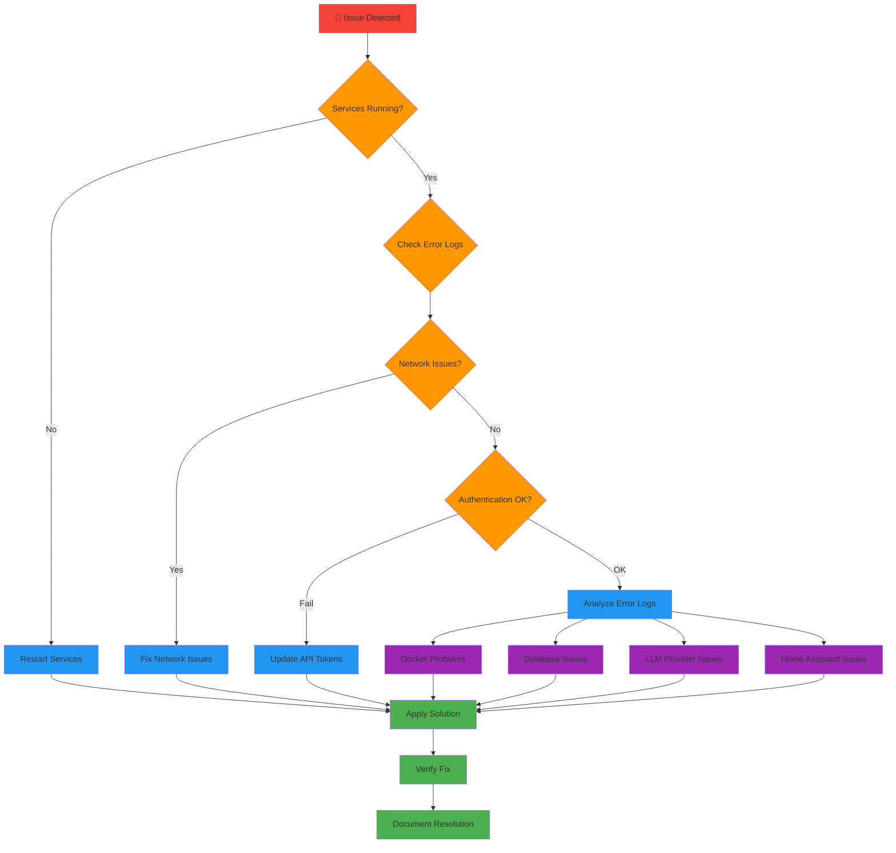
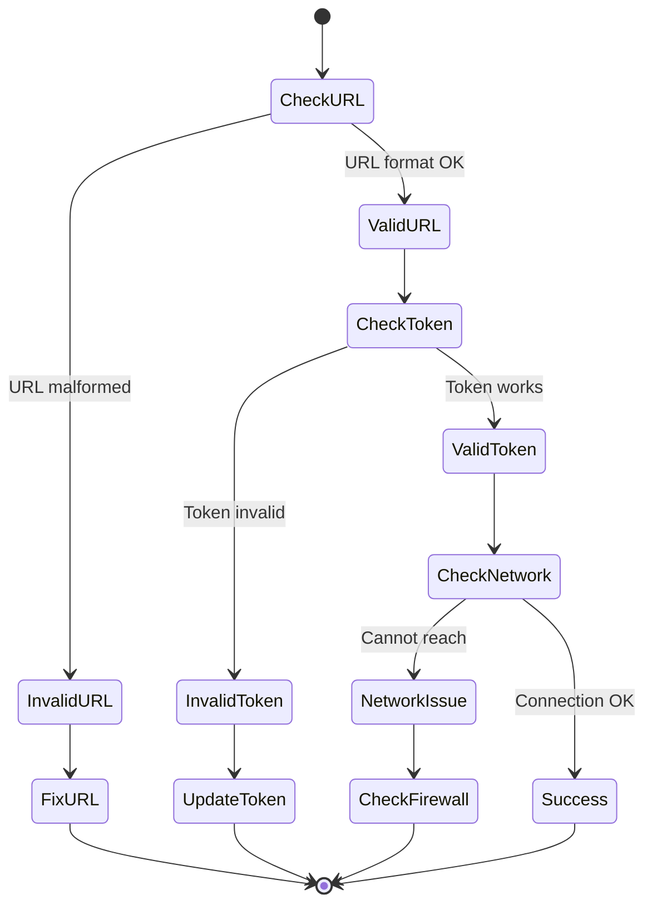
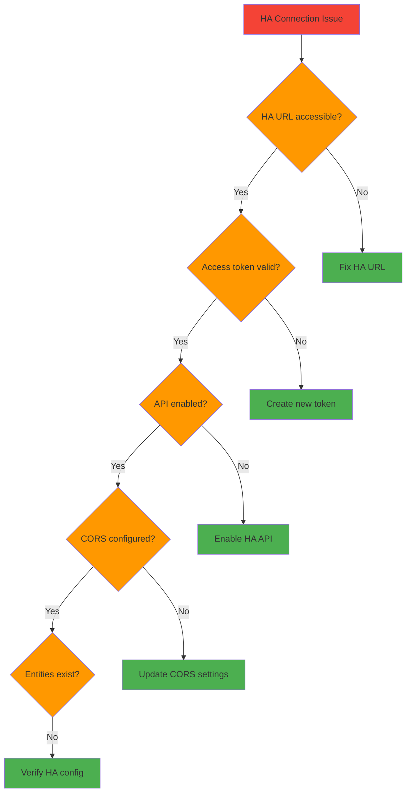
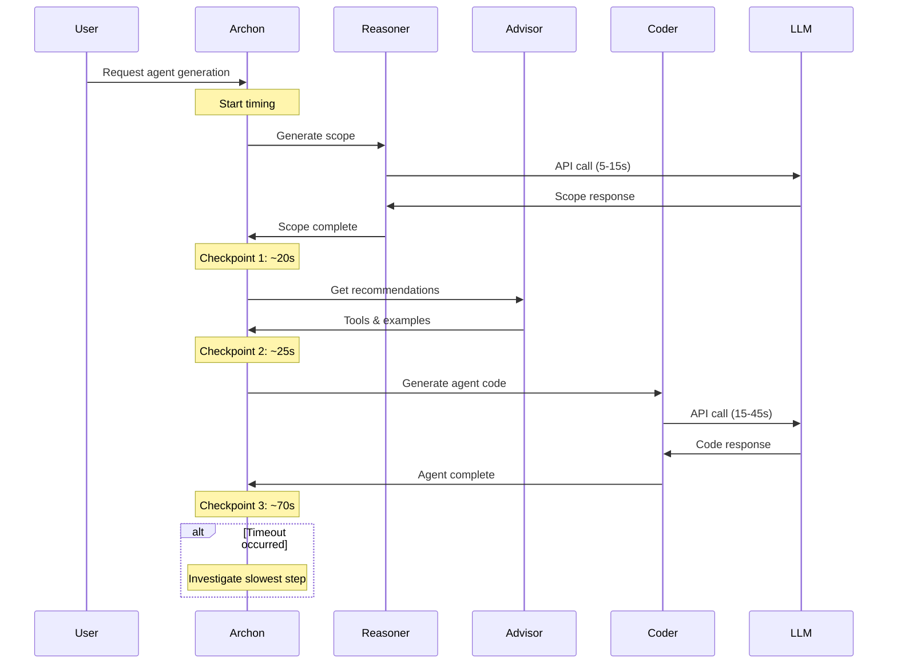

# Archon Troubleshooting Guide

## Overview

This comprehensive troubleshooting guide helps diagnose and resolve common issues with Archon and its Home Assistant integration (Marduk's Lab).

## 🚨 Quick Issue Resolution

### Emergency Troubleshooting Flowchart



## 🔧 Common Issues and Solutions

### 1. Installation and Setup Issues

#### Issue: Docker Build Fails
**Symptoms:**
- `docker build` command fails
- Missing dependencies errors
- Permission denied errors

**Diagnosis Steps:**
```bash
# Check Docker installation
docker --version
docker-compose --version

# Check available disk space
df -h

# Check Docker daemon status
sudo systemctl status docker

# View build logs
docker build --no-cache . 2>&1 | tee build.log
```

**Solutions:**
```bash
# Fix 1: Clean Docker cache
docker system prune -a

# Fix 2: Increase Docker memory limit
# Edit Docker Desktop settings > Resources > Memory > 8GB+

# Fix 3: Fix permissions (Linux)
sudo usermod -aG docker $USER
newgrp docker

# Fix 4: Update base image
# Edit Dockerfile to use latest Python image
```

#### Issue: Environment Variables Not Loading
**Symptoms:**
- API key errors
- "Environment variable not found" messages
- Services failing to connect

**Diagnosis:**
```bash
# Check if .env file exists
ls -la .env

# Verify environment variable format
cat .env | grep -v "^#" | head -10

# Check variables in container
docker exec archon-container env | grep -E "(LLM|SUPABASE|HOME_ASSISTANT)"
```

**Solutions:**
```bash
# Fix 1: Create proper .env file
cp .env.example .env
# Edit .env with your actual values

# Fix 2: Fix variable format (no spaces around =)
# Wrong: API_KEY = your_key
# Correct: API_KEY=your_key

# Fix 3: Restart containers to reload environment
docker-compose down && docker-compose up -d
```

### 2. Database Connection Issues

#### Issue: Supabase Connection Failed
**Symptoms:**
- "Connection refused" errors
- Database timeout errors
- Vector search failures

**Diagnosis Flow:**


**Solutions:**
```python
# Test Supabase connection
import os
from supabase import create_client

async def test_supabase_connection():
    try:
        url = os.getenv("SUPABASE_URL")
        key = os.getenv("SUPABASE_ANON_KEY")
        
        if not url or not key:
            print("❌ Missing Supabase credentials")
            return False
            
        supabase = create_client(url, key)
        
        # Test connection with simple query
        result = supabase.table("site_pages").select("id").limit(1).execute()
        print("✅ Supabase connection successful")
        return True
        
    except Exception as e:
        print(f"❌ Supabase connection failed: {e}")
        return False
```

#### Issue: Vector Database Performance
**Symptoms:**
- Slow search queries (> 5 seconds)
- High database CPU usage
- Timeout errors

**Optimization Steps:**
```sql
-- Check index status
SELECT indexname, tablename, indexdef 
FROM pg_indexes 
WHERE tablename = 'site_pages';

-- Create optimized vector index
CREATE INDEX CONCURRENTLY IF NOT EXISTS idx_site_pages_embedding_cosine 
ON site_pages USING ivfflat (embedding vector_cosine_ops)
WITH (lists = 100);

-- Analyze table statistics
ANALYZE site_pages;

-- Check query performance
EXPLAIN ANALYZE 
SELECT url, title, (embedding <=> '[1,2,3...]'::vector) as distance 
FROM site_pages 
ORDER BY embedding <=> '[1,2,3...]'::vector 
LIMIT 10;
```

### 3. LLM Provider Issues

#### Issue: OpenAI API Errors
**Symptoms:**
- Rate limit exceeded errors
- Invalid API key errors
- Model not available errors

**Diagnostic Script:**
```python
import openai
import os
from openai import OpenAI

async def diagnose_openai_issues():
    client = OpenAI(api_key=os.getenv("LLM_API_KEY"))
    
    try:
        # Test API key validity
        models = client.models.list()
        print("✅ API key valid")
        
        # Test specific model availability
        model = "gpt-4o-mini"
        response = client.chat.completions.create(
            model=model,
            messages=[{"role": "user", "content": "test"}],
            max_tokens=10
        )
        print(f"✅ Model {model} available")
        
        # Check rate limits
        headers = response.headers if hasattr(response, 'headers') else {}
        remaining = headers.get('x-ratelimit-remaining-requests', 'unknown')
        print(f"📊 Rate limit remaining: {remaining}")
        
    except openai.AuthenticationError:
        print("❌ Invalid API key")
    except openai.RateLimitError:
        print("❌ Rate limit exceeded")
    except openai.BadRequestError as e:
        print(f"❌ Bad request: {e}")
    except Exception as e:
        print(f"❌ Unexpected error: {e}")
```

**Solutions:**
```bash
# Fix 1: Update API key
export LLM_API_KEY="your_new_api_key"

# Fix 2: Switch to different model
export PRIMARY_MODEL="gpt-3.5-turbo"

# Fix 3: Implement retry logic with exponential backoff
# See code example below

# Fix 4: Use multiple providers for failover
export LLM_PROVIDER="openai,anthropic,ollama"
```

#### Issue: Local LLM (Ollama) Problems
**Symptoms:**
- "Connection refused" to localhost:11434
- Model loading errors
- Out of memory errors

**Solutions:**
```bash
# Check Ollama status
ollama ps

# Start Ollama if not running
ollama serve

# Check available models
ollama list

# Pull required model
ollama pull qwen2.5:14b-instruct-8k

# Check system resources
docker stats ollama-container

# Increase memory limit for Ollama
docker run -d -p 11434:11434 --memory=16g ollama/ollama
```

### 4. Home Assistant Integration Issues

#### Issue: Home Assistant Connection Failed
**Symptoms:**
- "Unauthorized" errors
- Connection timeout to HA instance
- Device commands not working

**Diagnostic Checklist:**


**Home Assistant Configuration Check:**
```yaml
# Required in configuration.yaml
api:
websocket_api:

http:
  cors_allowed_origins:
    - http://localhost:8501
    - http://localhost:8100
    - https://your-archon-domain.com

# Optional: Enable more detailed logging
logger:
  default: info
  logs:
    homeassistant.components.api: debug
    homeassistant.components.websocket_api: debug
```

**Token Validation Script:**
```python
import aiohttp
import asyncio

async def test_ha_connection(ha_url: str, token: str):
    headers = {"Authorization": f"Bearer {token}"}
    
    async with aiohttp.ClientSession() as session:
        try:
            # Test API availability
            async with session.get(f"{ha_url}/api/", headers=headers) as response:
                if response.status == 200:
                    print("✅ HA API accessible")
                    data = await response.json()
                    print(f"📊 HA version: {data.get('version', 'unknown')}")
                else:
                    print(f"❌ API error: {response.status}")
                    return False
            
            # Test entity access
            async with session.get(f"{ha_url}/api/states", headers=headers) as response:
                if response.status == 200:
                    entities = await response.json()
                    print(f"✅ Found {len(entities)} entities")
                    return True
                else:
                    print(f"❌ States error: {response.status}")
                    return False
                    
        except Exception as e:
            print(f"❌ Connection error: {e}")
            return False

# Usage
await test_ha_connection("http://homeassistant.local:8123", "your_token")
```

#### Issue: Device Commands Not Working
**Symptoms:**
- Commands appear successful but devices don't respond
- "Entity not found" errors
- Service call failures

**Debugging Steps:**
```python
async def debug_device_control(ha_url: str, token: str, entity_id: str):
    headers = {"Authorization": f"Bearer {token}"}
    
    async with aiohttp.ClientSession() as session:
        # 1. Check if entity exists
        async with session.get(f"{ha_url}/api/states/{entity_id}", headers=headers) as response:
            if response.status == 404:
                print(f"❌ Entity {entity_id} not found")
                # List similar entities
                async with session.get(f"{ha_url}/api/states", headers=headers) as list_response:
                    entities = await list_response.json()
                    similar = [e['entity_id'] for e in entities if entity_id.split('.')[1] in e['entity_id']]
                    print(f"💡 Similar entities: {similar[:5]}")
                return
            
            entity_data = await response.json()
            print(f"✅ Entity found: {entity_data['state']}")
            print(f"📋 Attributes: {entity_data.get('attributes', {})}")
        
        # 2. Check domain services
        domain = entity_id.split('.')[0]
        async with session.get(f"{ha_url}/api/services", headers=headers) as response:
            services = await response.json()
            domain_services = services.get(domain, {})
            print(f"🔧 Available {domain} services: {list(domain_services.keys())}")
        
        # 3. Test service call
        service_data = {
            "entity_id": entity_id
        }
        
        async with session.post(
            f"{ha_url}/api/services/{domain}/turn_on", 
            headers=headers, 
            json=service_data
        ) as response:
            if response.status == 200:
                print("✅ Service call successful")
            else:
                error = await response.text()
                print(f"❌ Service call failed: {error}")
```

### 5. Agent Generation Issues

#### Issue: Agent Generation Timeout
**Symptoms:**
- Generation process takes > 5 minutes
- "Request timeout" errors
- Incomplete agent output

**Performance Analysis:**


**Optimization Solutions:**
```python
# Implement timeout handling
import asyncio
from typing import Optional

async def generate_agent_with_timeout(
    user_request: str, 
    timeout_seconds: int = 120
) -> Optional[dict]:
    try:
        result = await asyncio.wait_for(
            generate_agent(user_request),
            timeout=timeout_seconds
        )
        return result
    except asyncio.TimeoutError:
        print(f"❌ Agent generation timed out after {timeout_seconds}s")
        # Log partial progress for debugging
        return None

# Stream partial results
async def generate_agent_streaming(user_request: str):
    yield {"step": "scope", "status": "starting"}
    
    scope = await generate_scope(user_request)
    yield {"step": "scope", "status": "complete", "data": scope}
    
    recommendations = await get_recommendations(scope)
    yield {"step": "advisor", "status": "complete", "data": recommendations}
    
    agent_code = await generate_code(scope, recommendations)
    yield {"step": "coder", "status": "complete", "data": agent_code}
```

#### Issue: Poor Agent Quality
**Symptoms:**
- Generated agents don't work
- Missing functionality
- Code errors in output

**Quality Improvement Steps:**

1. **Scope Analysis:**
```python
def analyze_scope_quality(scope: str) -> dict:
    quality_metrics = {
        "length": len(scope),
        "detail_level": scope.count('\n'),
        "requirements_count": scope.count('requirement'),
        "tools_mentioned": scope.count('tool'),
        "examples_referenced": scope.count('example')
    }
    
    issues = []
    if quality_metrics["length"] < 500:
        issues.append("Scope too brief")
    if quality_metrics["requirements_count"] < 3:
        issues.append("Insufficient requirements")
    if quality_metrics["tools_mentioned"] < 2:
        issues.append("No tools specified")
    
    return {"metrics": quality_metrics, "issues": issues}
```

2. **Code Validation:**
```python
import ast
import subprocess

def validate_agent_code(code: str) -> dict:
    results = {"syntax_valid": False, "imports_valid": False, "structure_valid": False}
    
    try:
        # Check syntax
        ast.parse(code)
        results["syntax_valid"] = True
        
        # Check imports (simplified)
        required_imports = ["pydantic_ai", "asyncio"]
        for imp in required_imports:
            if imp in code:
                results["imports_valid"] = True
                break
        
        # Check structure
        if "Agent(" in code and "system_prompt" in code:
            results["structure_valid"] = True
            
    except SyntaxError as e:
        results["syntax_error"] = str(e)
    
    return results
```

### 6. Performance Issues

#### Issue: High Memory Usage
**Symptoms:**
- System memory > 85%
- Container OOM kills
- Slow response times

**Memory Analysis:**
```bash
# Check system memory
free -h

# Check Docker container memory
docker stats --no-stream

# Check Python memory usage
python -c "
import psutil
import os
process = psutil.Process(os.getpid())
print(f'Memory: {process.memory_info().rss / 1024 / 1024:.1f} MB')
"

# Profile memory usage
pip install memory-profiler
python -m memory_profiler your_script.py
```

**Memory Optimization:**
```python
import gc
import asyncio

# Implement memory cleanup
async def cleanup_resources():
    # Clear caches periodically
    cache.clear()
    
    # Force garbage collection
    gc.collect()
    
    # Close unused connections
    await close_idle_connections()

# Memory-efficient vector search
async def efficient_vector_search(query, limit=10):
    # Use generator to avoid loading all results
    async for result in stream_search_results(query, limit):
        yield result
        
    # Clean up immediately
    del result
    gc.collect()
```

## 🔍 Log Analysis and Debugging

### Log Location Guide

```mermaid
graph TD
    subgraph "📁 Log Files"
        ARCHON[/workbench/logs.txt]
        DOCKER[Docker container logs]
        STREAMLIT[Streamlit logs]
        HA[Home Assistant logs]
        SYSTEM[System logs]
    end
    
    subgraph "🔧 Log Tools"
        GREP[grep patterns]
        TAIL[tail -f]
        JQ[jq JSON parser]
        LESS[less pager]
    end
    
    ARCHON --> GREP
    DOCKER --> TAIL
    STREAMLIT --> JQ
    HA --> LESS
    
    classDef logs fill:#2196f3
    classDef tools fill:#4caf50
    
    class ARCHON,DOCKER,STREAMLIT,HA,SYSTEM logs
    class GREP,TAIL,JQ,LESS tools
```

### Useful Log Commands

```bash
# Real-time Archon logs
tail -f /home/runner/work/Archon/Archon/workbench/logs.txt

# Docker container logs
docker logs -f archon-container
docker logs -f mcp-container

# Filter for errors only
docker logs archon-container 2>&1 | grep -i error

# Analyze JSON logs with jq
docker logs archon-container --since 1h | jq '.level, .message'

# Home Assistant logs
tail -f /config/home-assistant.log | grep -i archon

# System resource logs
journalctl -u docker.service -f
```

### Common Error Patterns

#### Pattern 1: API Rate Limits
```bash
# Search for rate limit errors
grep -i "rate.limit\|429\|quota" /workbench/logs.txt

# Example error:
# "RateLimitError: You exceeded your current quota"
```

#### Pattern 2: Database Connection Issues
```bash
# Search for database errors
grep -i "connection\|database\|supabase" /workbench/logs.txt

# Example errors:
# "ConnectionError: Unable to connect to Supabase"
# "TimeoutError: Database query timed out"
```

#### Pattern 3: Home Assistant Issues
```bash
# Search for HA-related errors
grep -i "home.assistant\|ha_\|marduk" /workbench/logs.txt

# Example errors:
# "AuthenticationError: Invalid Home Assistant token"
# "EntityNotFoundError: light.living_room not found"
```

## 📞 Getting Help

### Information to Collect Before Reporting Issues

1. **System Information:**
```bash
# Create diagnostic report
cat > diagnostic_report.txt << EOF
=== Archon Diagnostic Report ===
Date: $(date)
OS: $(uname -a)
Docker Version: $(docker --version)
Python Version: $(python --version)

=== Environment Variables ===
$(env | grep -E "(LLM|SUPABASE|HOME_ASSISTANT)" | sed 's/=.*/=***/')

=== Docker Status ===
$(docker ps)

=== Recent Logs (last 50 lines) ===
$(tail -50 /workbench/logs.txt 2>/dev/null || echo "No logs found")

=== System Resources ===
$(free -h)
$(df -h)
EOF
```

2. **Error Reproduction Steps:**
   - Exact steps to reproduce the issue
   - Expected vs actual behavior
   - Screenshots if applicable
   - Timing information

3. **Configuration Details:**
   - Archon version
   - LLM provider and model
   - Home Assistant version (if applicable)
   - Custom configurations

### Support Channels

- **GitHub Issues**: For bugs and feature requests
- **Community Forum**: [Archon Think Tank](https://thinktank.ottomator.ai/c/archon/30)
- **Documentation**: Check this guide and [docs/README.md](README.md)

---

*This troubleshooting guide is continuously updated based on community feedback and common issues encountered in production deployments.*