# Archon Workflow and Data Flow Documentation

## Cognitive Workflow Overview

The Archon system implements a sophisticated multi-agent workflow that demonstrates emergent cognitive patterns through recursive implementation pathways and adaptive attention allocation mechanisms.

## LangGraph State Management

### State Schema and Transitions

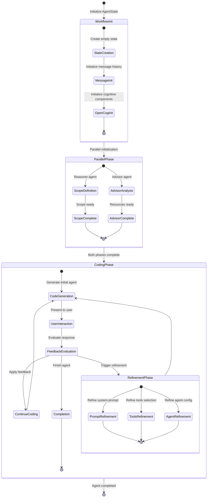

### State Data Structure

```python
class AgentState(TypedDict):
    # User interaction state
    latest_user_message: str
    messages: Annotated[List[bytes], lambda x, y: x + y]
    
    # Agent artifacts
    scope: str
    advisor_output: str
    file_list: List[str]
    
    # Refinement outputs
    refined_prompt: str
    refined_tools: str
    refined_agent: str
    
    # OpenCog cognitive state
    atomspace: Any
    cogserver: Any
    utilities: Any
```

## Agent Interaction Patterns

### Multi-Agent Coordination

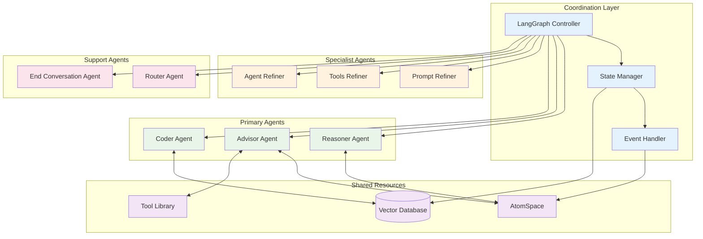

## Detailed Workflow Sequences

### Agent Creation Complete Sequence

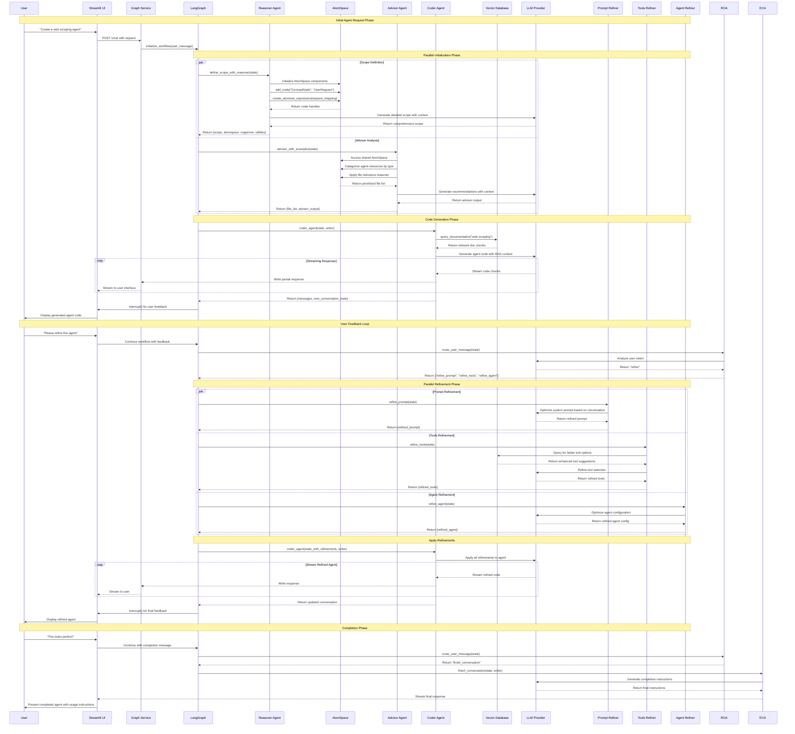

### OpenCog Knowledge Integration Flow

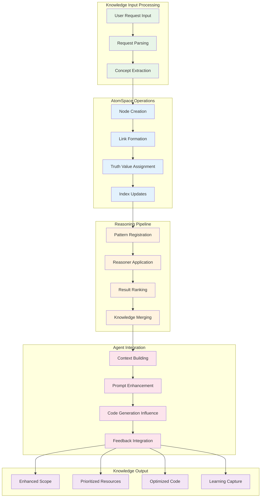

## Data Propagation Pathways

### Vector Database Integration

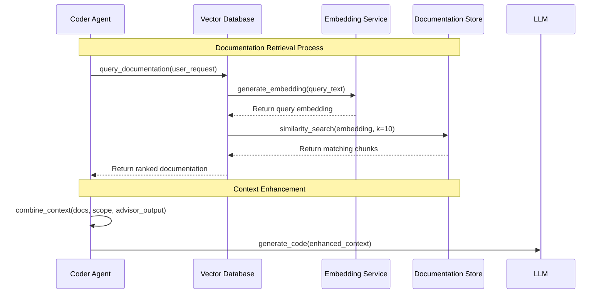

### Tool Library Interaction

```mermaid
graph LR
    subgraph "Tool Discovery"
        AA[Advisor Agent]
        FS[File System Scanner]
        CAT[Categorizer]
    end
    
    subgraph "Relevance Computation"
        AS[AtomSpace Reasoner]
        SCORE[Scoring Engine]
        RANK[Ranking System]
    end
    
    subgraph "Tool Integration"
        SEL[Tool Selector]
        TEMPL[Template Processor]
        CODE[Code Injector]
    end
    
    subgraph "Quality Assurance"
        VAL[Validator]
        TEST[Tester]
        OPT[Optimizer]
    end
    
    AA --> FS
    FS --> CAT
    CAT --> AS
    
    AS --> SCORE
    SCORE --> RANK
    RANK --> SEL
    
    SEL --> TEMPL
    TEMPL --> CODE
    CODE --> VAL
    
    VAL --> TEST
    TEST --> OPT
    OPT --> AA
    
    classDef discovery fill:#e8f5e8
    classDef computation fill:#e3f2fd
    classDef integration fill:#fff3e0
    classDef quality fill:#fce4ec
    
    class AA,FS,CAT discovery
    class AS,SCORE,RANK computation
    class SEL,TEMPL,CODE integration
    class VAL,TEST,OPT quality
```

## Recursive Feedback Mechanisms

### Learning Loop Implementation

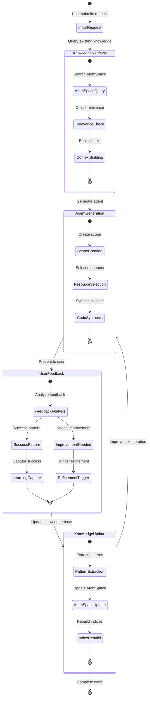

### Adaptive Attention Allocation

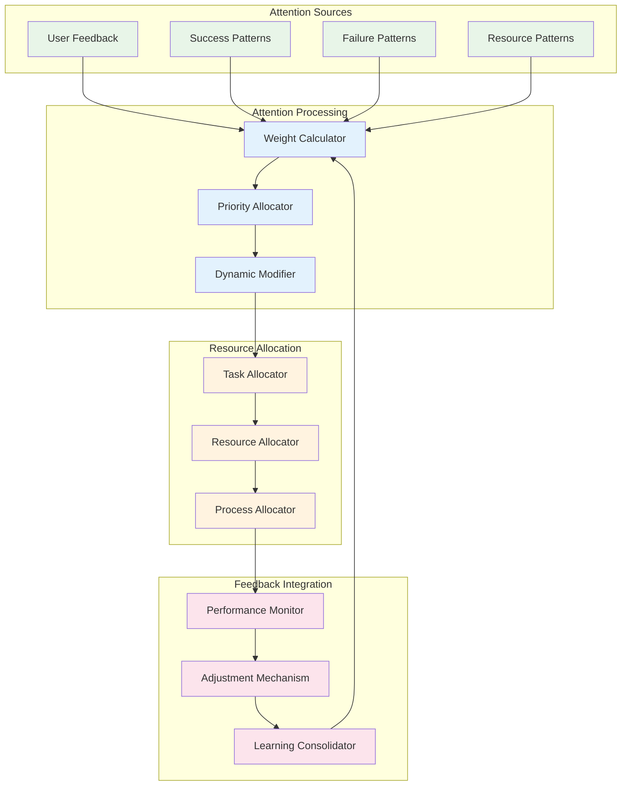

## Emergent Pattern Recognition

### Pattern Evolution Tracking

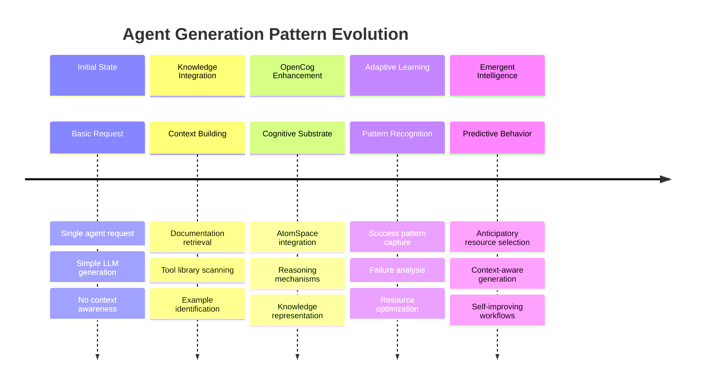

### Hypergraph Pattern Discovery

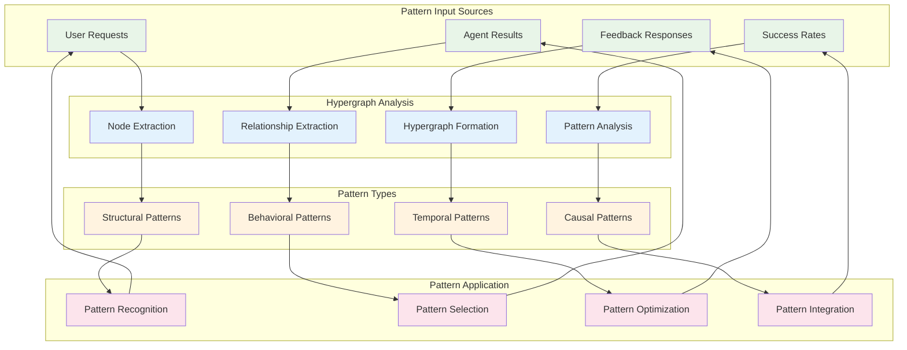

## Performance Optimization Pathways

### Parallel Processing Architecture

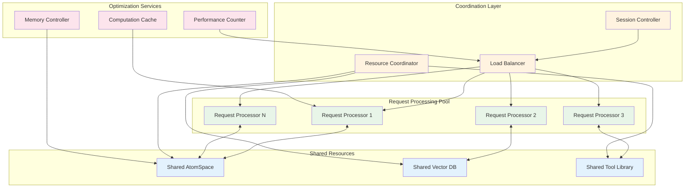

This comprehensive workflow documentation captures the recursive implementation pathways and emergent cognitive patterns that arise from the hypergraph-centric architecture, demonstrating how adaptive attention allocation mechanisms enable distributed cognition across the Archon agent ecosystem.